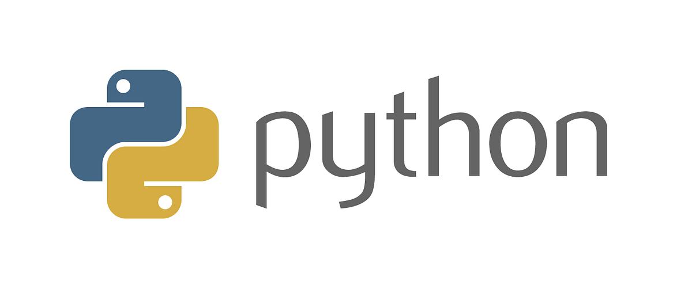
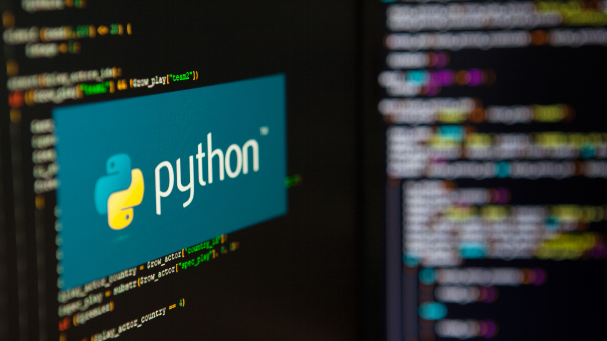
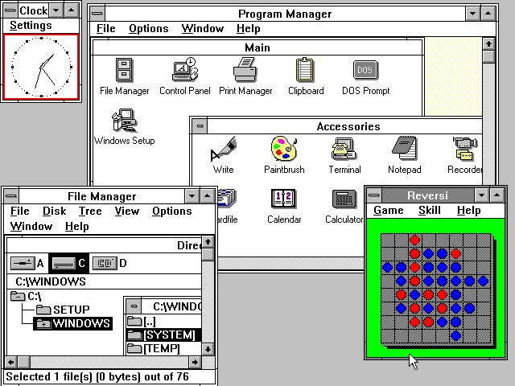

# 语言介绍



## 背景与起源

>  何为Python?
>  引用官网一句话:Python是一个高层次的结合了解释性,编译性,互动性和面向对象的脚本语言
>
>  它的设计具有很强的可读性,她比其他语言更有特色的语法结构！
>  Python 是由 Guido van Rossum 在八十年代末和九十年代初，在荷兰国家数学和计算机科学研究所设计出来的。

### 起源

Python的作者，Guido von Rossum，确实是荷兰人。1982年，Guido从阿姆斯特丹大学获得了数学和计算机硕士学位。然而，尽管他算得上是一位数学家，但他更加享受计算机带来的乐趣。用他的话说，尽管拥有数学和计算机双料资质，他总趋向于做计算机相关的工作，并热衷于做任何和编程相关的活儿。


在那个时候，Guido接触并使用过诸如Pascal、C、 Fortran等语言。这些语言的基本设计原则是让机器能更快运行。在80年代，虽然IBM和苹果已经掀起了个人电脑浪潮，但这些个人电脑的配置很低。比如早期的Macintosh，只有8MHz的CPU主频和128KB的RAM，一个大的数组就能占满内存。所有的编译器的核心是做优化，以便让程序能够运行。为了增进效率，语言也迫使程序员像计算机一样思考，以便能写出更符合机器口味的程序。在那个时代，程序员恨不得用手榨取计算机每一寸的能力。有人甚至认为C语言的指针是在浪费内存。至于动态类型，内存自动管理，面向对象…… 别想了，那会让你的电脑陷入瘫痪。 

这种编程方式让Guido感到苦恼。Guido知道如何用C语言写出一个功能，但整个编写过程需要耗费大量的时间，即使他已经准确的知道了如何实现。他的另一个选择是shell。Bourne Shell作为UNIX系统的解释器已经长期存在。UNIX的管理员们常常用shell去写一些简单的脚本，以进行一些系统维护的工作，比如定期备份、文件系统管理等等。shell可以像胶水一样，将UNIX下的许多功能连接在一起。许多C语言下上百行的程序，在shell下只用几行就可以完成。然而，shell的本质是调用命令。它并不是一个真正的语言。比如说，shell没有数值型的数据类型，加法运算都很复杂。总之，shell不能全面的调动计算机的功能。 

Guido希望有一种语言，这种语言能够像C语言那样，能够全面调用计算机的功能接口，又可以像shell那样，可以轻松的编程。ABC语言让Guido看到希望。ABC是由荷兰的数学和计算机研究所开发的。Guido在该研究所工作，并参与到ABC语言的开发。ABC语言以教学为目的。与当时的大部分语言不同，ABC语言的目标是“让用户感觉更好”。ABC语言希望让语言变得容易阅读，容易使用，容易记忆，容易学习，并以此来激发人们学习编程的兴趣。比如下面是一段来自Wikipedia的ABC程序，这个程序用于统计文本中出现的词的总数：

```ABC
HOW TO RETURN words document:
   PUT {} IN collection
   FOR line IN document:
      FOR word IN split line:
         IF word not.in collection:
            INSERT word IN collection
   RETURN collection
```

HOW TO用于定义一个函数。一个Python程序员应该很容易理解这段程序。ABC语言使用冒号和缩进来表示程序块。行尾没有分号。for和if结构中也没有括号()。赋值采用的是PUT，而不是更常见的等号。这些改动让ABC程序读起来像一段文字。 

尽管已经具备了良好的可读性和易用性，ABC语言最终没有流行起来。在当时，ABC语言编译器需要比较高配置的电脑才能运行。而这些电脑的使用者通常精通计算机，他们更多考虑程序的效率，而非它的学习难度。除了硬件上的困难外，ABC语言的设计也存在一些致命的问题：

可拓展性差。ABC语言不是模块化语言。如果想在ABC语言中增加功能，比如对图形化的支持，就必须改动很多地方。

不能直接进行IO。ABC语言不能直接操作文件系统。尽管你可以通过诸如文本流的方式导入数据，但ABC无法直接读写文件。输入输出的困难对于计算机语言来说是致命的。你能想像一个打不开车门的跑车么？

过度革新。ABC用自然语言的方式来表达程序的意义，比如上面程序中的HOW TO 。然而对于程序员来说，他们更习惯用function或者define来定义一个函数。同样，程序员更习惯用等号来分配变量。尽管ABC语言很特别，但学习难度也很大。

传播困难。ABC编译器很大，必须被保存在磁带上。当时Guido在访问的时候，就必须有一个大磁带来给别人安装ABC编译器。 这样，ABC语言就很难快速传播。 

1989年，为了打发圣诞节假期，Guido开始写Python语言的编译器。Python这个名字，来自Guido所挚爱的电视剧Monty Python's Flying Circus。他希望这个新的叫做Python的语言，能符合他的理想：创造一种C和shell之间，功能全面，易学易用，可拓展的语言。Guido作为一个语言设计爱好者，已经有过设计语言的尝试。这一次，也不过是一次纯粹的hacking行为。


### 一门语言的诞生

1991年，第一个Python编译器诞生。它是用C语言实现的，并能够调用C语言的库文件。从一出生，Python已经具有了：类，函数，异常处理，包含表和词典在内的核心数据类型，以及模块为基础的拓展系统。

Python语法很多来自C，但又受到ABC语言的强烈影响。来自ABC语言的一些规定直到今天还富有争议，比如强制缩进。但这些语法规定让Python容易读。另一方面，Python聪明的选择服从一些惯例，特别是C语言的惯例，比如回归等号赋值。Guido认为，如果“常识”上确立的东西，没有必要过度纠结。

Python从一开始就特别在意可拓展性。Python可以在多个层次上拓展。从高层上，你可以直接引入.py文件。在底层，你可以引用C语言的库。Python程序员可以快速的使用Python写.py文件作为拓展模块。但当性能是考虑的重要因素时，Python程序员可以深入底层，写C程序，编译为.so文件引入到Python中使用。Python就好像是使用钢构建房一样，先规定好大的框架。而程序员可以在此框架下相当自由的拓展或更改。

最初的Python完全由Guido本人开发。Python得到Guido同事的欢迎。他们迅速的反馈使用意见，并参与到Python的改进。Guido和一些同事构成Python的核心团队。他们将自己大部分的业余时间用于hack Python。随后，Python拓展到研究所之外。Python将许多机器层面上的细节隐藏，交给编译器处理，并凸显出逻辑层面的编程思考。Python程序员可以花更多的时间用于思考程序的逻辑，而不是具体的实现细节。这一特征吸引了广大的程序员。Python开始流行。



### 时势造英雄

我们不得不暂停我们的Python时间，转而看一看瞬息万变的计算机行业。1990年代初，个人计算机开始进入普通家庭。Intel发布了486处理器，windows发布window 3.0开始的一系列视窗系统。计算机的性能大大提高。程序员开始关注计算机的易用性  ，比如图形化界面。



由于计算机性能的提高，软件的世界也开始随之改变。硬件足以满足许多个人电脑的需要。硬件厂商甚至渴望高需求软件的出现，以带动硬件的更新换代。C++和Java相继流行。C++和Java提供了面向对象的编程范式，以及丰富的对象库。在牺牲了一定的性能的代价下，C++和Java大大提高了程序的产量。语言的易用性被提到一个新的高度。我们还记得，ABC失败的一个重要原因是硬件的性能限制。从这方面说，Python要比ABC幸运许多。

另一个悄然发生的改变是Internet。1990年代还是个人电脑的时代，windows和Intel挟PC以令天下，盛极一时。尽管Internet为主体的信息革命尚未到来，但许多程序员以及资深计算机用户已经在频繁使用Internet进行交流，比如使用email和newsgroup。Internet让信息交流成本大大下降。一种新的软件开发模式开始流行：开源。程序员利用业余时间进行软件开发，并开放源代码。1991年，Linus在comp.os.minix新闻组上发布了Linux内核源代码，吸引大批hacker的加入。Linux和GNU相互合作，最终构成了一个充满活力的开源平台。

硬件性能不是瓶颈，Python又容易使用，所以许多人开始转向Python。Guido维护了一个maillist，Python用户就通过邮件进行交流。Python用户来自许多领域，有不同的背景，对Python也有不同的需求。Python相当的开放，又容易拓展，所以当用户不满足于现有功能，很容易对Python进行拓展或改造。随后，这些用户将改动发给Guido，并由Guido决定是否将新的特征加入到Python或者标准库中。如果代码能被纳入Python自身或者标准库，这将极大的荣誉。由于Guido至高无上的决定权，他因此被称为“终身的仁慈独裁者”。

Python被称为“Battery Included”，是说它以及其标准库的功能强大。这些是整个社区的贡献。Python的开发者来自不同领域，他们将不同领域的优点带给Python。比如Python标准库中的正则表达是参考Perl，而lambda, map, filter, reduce等函数参考了Lisp。Python本身的一些功能以及大部分的标准库来自于社区。Python的社区不断扩大，进而拥有了自己的newsgroup，网站，以及基金。从Python 2.0开始，Python也从maillist的开发方式，转为完全开源的开发方式。社区气氛已经形成，工作被整个社区分担，Python也获得了更加高速的发展。

到今天，Python的框架已经确立。Python语言以对象为核心组织代码，支持多种编程范式，采用动态类型，自动进行内存回收。Python支持解释运行，并能调用C库进行拓展。Python有强大的标准库。由于标准库的体系已经稳定，所以Python的生态系统开始拓展到第三方包。这些包，如Django、web.py、wxpython、numpy、matplotlib、PIL，将Python升级成了物种丰富的热带雨林。

## 应用场景

创始人guido希望Python在每个领域都能火起来，而Python也不负众望，已经在云计算、云服务、人工智能、web、科学计算、大数据等领域站稳了脚跟。

在未来十年的时间里可以Python会越来越火，为了跟上时代的潮流,技多不压身，学习和了解下总是没有错的！


## 语言特性


- 免费、开源：Python是一款FLOSS(自由/源代码软件)之一，使用者可以自由地发布这个软件的拷贝、阅读它的源代码、对它做改动、把它的一部分用于新的自由软件中。FLOSS是基于一个团体分享知识的概念。

### 语法

- 简单：Python是一种代表简单主义思想的语言。
- 易用：Python简单容易上手，因为有简单容易看懂的文档。
- 速度快：运行速度快，因为Python中的标准库和第三方库都是C语言编写的，所以很快。
- 高层语言：用Python语言编写程序的时候无需考虑诸如如何管理你的程序使用的内存一类的底层细节。
- 面向对象：Python既支持面向过程的编程也支持面向对象的编程。在“面向过程”的语言中，程序是由过程或仅仅是可重用代码的函数构建起来的。在“面向对象”的语言中，程序是由数据和功能组合而成的对象构建起来的。

### 运行

- 可移植性：由于它的开源本质，Python已经被移植在许多平台上（经过改动使它能够工作在不同平台上）。这些平台包括Linux、Windows、 FreeBSD、Macintosh、Solaris、OS/2、Amiga、AROS、AS/400、BeOS、OS/390、z/OS、Palm OS、QNX、VMS、Psion、Acom RISC OS、VxWorks、PlayStation、Sharp Zaurus、Windows CE、PocketPC、Symbian以及Google基于linux开发的android平台。

- 解释性：一个用编译性语言比如C或C++写的程序可以从源文件（即C或C++语言）转换到一个你的计算机使用的语言（二进制代码，即0和1）。这个过程通过编译器和不同的标记、选项完成。运行程序的时候，连接/转载器软件把你的程序从硬盘复制到内存中并且运行。而Python语言写的程序不需要编译成二进制代码。你可以直接从源代码运行 程序。在计算机内部，Python解释器把源代码转换成称为字节码的中间形式，然后再把它翻译成计算机使用的机器语言并运行。这使得使用Python更加简单。也使得Python程序更加易于移植。

- 可扩展性：如果需要一段关键代码运行得更快或者希望某些算法不公开，可以部分程序用C或C++编写，然后在Python程序中使用它们。

- 可嵌入性：可以把Python嵌入C/C++程序，从而向程序用户提供脚本功能。

### 生态

- 丰富的库：Python标准库确实很庞大。它可以帮助处理各种工作，包括 正则表达式、文档生成、 单元测试、 线程、数据库、网页浏览器、CGI、FTP、电子邮件、XML、XML-RPC、HTML、WAV文件、密码系统、GUI（ 图形用户界面）、Tk和其他与系统有关的操作。这被称作Python的“功能齐全”理念。除了标准库以外，还有许多其他高质量的库，如wxPython、Twisted和Python图像库等等。

### 缺点

- 单行语句和命令行输出问题：很多时候不能将程序连写成一行，如import sys;for i in sys.path:print i。而perl和awk就无此限制，可以较为方便的在shell下完成简单程序，不需要如Python一样，必须将程序写入一个.py文件。
- 独特的语法：这也许不应该被称为局限，但是它用缩进来区分语句关系的方式还是给很多初学者带来了困惑。即便是很有经验的Python程序员，也可能陷入陷阱当中。最常见的情况是tab和空格的混用会导致错误，而这是用肉眼无法分别的。
- 运行速度慢：这里是指与C和C++相比。

# 语法教学

## 基本语法

### 输入与输出

```python
x = input("x: ")
print(x)
```

### 函数

#### 内置函数

[Python 内置函数](https://docs.python.org/zh-cn/3/library/functions.html)

#### 导入模块中的函数

[Python 标准库](https://docs.python.org/zh-cn/3/library/index.html)

```python
import math


print(math.floor(32.9))
```

```python
from datetime import datetime

print(datetime.now())
```

#### 自己编写函数

```python
def add(a: int, b: int) -> int:
    return a + b


a = int(input("a="))
b = int(input("b="))
print("a+b={}".format(add(a, b)))
```

## 逻辑语句

### 条件判断

| 表达式     | 描述                |
| ---------- | ------------------- |
| x == y     | x 等于 y            |
| x < y      | x 小于 y            |
| x > y      | x 大于 y            |
| x >= y     | x 大于或等于 y      |
| x<= y      | x 小于或等于 y      |
| x != y     | x 不等于 y          |
| x is y     | x 和 y 是同一个对象 |
| x is not y | x 和 y 是不同的对象 |
| x in y     | x 是容器 y 的成员   |
| x not in y | x 不是容器 y 的成员 |

- if
- else
- elif

```python
num = int(input('Enter a number:'))
if num > 0:
    print('The number is positive')
elif num < 0:
    print('The number is negative')
else:
    print('The number is zero')
```

### 循环

- while

  ```python
  x = 1
  while x <= 100:
      print(x)
      x += 1
  ```

- for

  ```python
  for x in range(1, 101, 1):
      print(x)
  ```

  ```python
  words = ['this', 'is', 'an', 'ex', 'parrot']
  for word in words:
      print(word)
  ```

## 数据结构

### 字符串

```python
s = 'hello world'
```

- 字符串连接
- 求字符串长度
- 字符串索引
- 切片操作
- 字符串查找
- 字符串替换
- 字符串分割
- 字符串格式化
- 字符串大小写转换
- 字符串去除空白
- 字符串判断

### 列表和元组

```
l = [1,2,3,4,5]
t = (1,2,3,4,5)
```

- 索引访问列表
- 修改列表
- 求列表长度
- 列表切片
- 列表追加元素
- 列表合并
- 列表插入元素
- 列表删除元素
- 列表排序
- 列表拷贝
- 列表循环

### 字典

```python
my_dict = {"name": "Alice", "age": 25, "city": "New York"}
```

- 访问字典元素
- 修改字典元素
- 添加新的键值对
- 删除键值对
- 求字典大小
- 字典键列表
- 字典遍历
- 字典合并
- 字典拷贝

# 作业

作业难度跟Lvx无关，非递增顺序

## Lv0

熟悉本节课教的python语法

## Lv1

### 题目背景

输入两个整数 a，b，输出它们的和 $(|a|,|b|\leq10^9)$

### 输入格式

两个以空格分开的整数。

### 输出格式

一个整数。

### 输入输出样例

**输入 #1**

```
20 30
```

**输出 #1**

```
50
```

## Lv2

### 题目描述

给定一个整数 *N*，请将该数各个位上数字反转得到一个新数。新数也应满足整数的常见形式，即除非给定的原数为零，否则反转后得到的新数的最高位数字不应为零（参见样例 2）。

### 输入格式

一个整数 *N*。

### 输出格式

一个整数，表示反转后的新数。

### 输入输出样例

**输入 #1**

```
123
```

**输出 #1**

```
321
```

**输入 #2**

```
-380
```

**输出 #2**

```
-83
```

## Lv3

### 题目描述

输入一行字符，统计出每个数字字符(0-9)的个数。

### 输入格式

一行字符串，总长度不超过 $255$。

### 输出格式

输出为 9 行，输出字符串里面对应数字字符的个数。

第 n 行 输入 数字 n 出现的次数

**样例 #1**

**样例输入 #1**

```
Today is 2021-03-27
```

**样例输出 #1**

```
2
1
3
1
0
0
0
1
0
0
```

## Lv4

某校的惯例是在每学期的期末考试之后发放奖学金。发放的奖学金共有五种，获取的条件各自不同：

1. 院士奖学金，每人 $8000$ 元，期末平均成绩高于 $80$ 分（$>80$），并且在本学期内发表$1$篇或$1$篇以上论文的学生均可获得；
2. 五四奖学金，每人 $4000$ 元，期末平均成绩高于 $85$ 分（$>85$），并且班级评议成绩高于 $80$ 分（$>80$）的学生均可获得；
3. 成绩优秀奖，每人 $2000$ 元，期末平均成绩高于 $90$ 分（$>90$）的学生均可获得；
4. 西部奖学金，每人 $1000$ 元，期末平均成绩高于 $85$ 分（$>85$）的西部省份学生均可获得；
5. 班级贡献奖，每人 $850$ 元，班级评议成绩高于 $80$ 分（$>80$）的学生干部均可获得；

只要符合条件就可以得奖，每项奖学金的获奖人数没有限制，每名学生也可以同时获得多项奖学金。例如姚林的期末平均成绩是 $87$ 分，班级评议成绩 $82$ 分，同时他还是一位学生干部，那么他可以同时获得五四奖学金和班级贡献奖，奖金总数是 $4850$ 元。

现在给出若干学生的相关数据，请计算哪些同学获得的奖金总数最高（假设总有同学能满足获得奖学金的条件）。

### 输入格式

第一行是$1$个整数 $N$，表示学生的总数。

接下来的 $N$ 行每行是一位学生的数据，从左向右依次是姓名，期末平均成绩，班级评议成绩，是否是学生干部，是否是西部省份学生，以及发表的论文数。姓名是由大小写英文字母组成的长度不超过 $20$ 的字符串（不含空格）；期末平均成绩和班级评议成绩都是 $0$ 到 $100$ 之间的整数（包括 $0$ 和 $100$）；是否是学生干部和是否是西部省份学生分别用 $1$ 个字符表示，$\tt Y$ 表示是，$\tt N$ 表示不是；发表的论文数是 $0$ 到 $10$ 的整数（包括 $0$ 和 $10$）。每两个相邻数据项之间用一个空格分隔。

### 输出格式

共 $3$ 行。

- 第 $1$ 行是获得最多奖金的学生的姓名。如果有两位或两位以上的学生获得的奖金最多，输出他们之中在输入文件中出现最早的学生的姓名。
- 第 $2$ 行是这名学生获得的奖金总数。
- 第 $3$ 行是这 $N$ 个学生获得的奖学金的总数。

**样例 #1**

**样例输入 #1**

```
4
YaoLin 87 82 Y N 0
ChenRuiyi 88 78 N Y 1
LiXin 92 88 N N 0
ZhangQin 83 87 Y N 1
```

**样例输出 #1**

```
ChenRuiyi
9000
28700
```

**【数据范围】**

对于 $100\%$ 的数据，满足 $1 \le  N \le  100$。

## 作业提交事项

**提交地址**：a@stellaris.wang

**提交格式：**第一次作业-202321xxxx-王鑫

**截止时间：**下一次上课之前

# 参考链接

[Python 语言的发展简史](https://linux.cn/article-3906-1.html)

[Python 基础教程(第3版)](https://item.jd.com/12279949.html)