# Pip换源

检查一下pip是否安装了，没有提示pip不存在就说明安装了。

```bash
pip --version
```

> 一般下载python的时候都是自动安装的，如果没安装的话看一下这个：https://pip.pypa.io/en/stable/installation/

pip设置的默认源是官方源：https://pypi.org/simple，这个源在国内的下载速度是很慢的，所以我们为了提高包的下载速度我们可以通过换源来实现。（如果你速度正常可以无视）

1. 临时换源

   ```bash
   pip install {软件包名} -i https://pypi.tuna.tsinghua.edu.cn/simple
   ```

   ```bash
   # 清华源
   pip install numpy -i https://pypi.tuna.tsinghua.edu.cn/simple
   # 阿里源
   pip install numpy -i https://mirrors.aliyun.com/pypi/simple/
   # 腾讯源
   pip install numpy -i http://mirrors.cloud.tencent.com/pypi/simple
   # 豆瓣源
   pip install numpy -i http://pypi.douban.com/simple/
   ```

2. 永久换源（一劳永逸）

   ```bash
   # 清华源
   pip config set global.index-url https://pypi.tuna.tsinghua.edu.cn/simple
   
   # 阿里源
   pip config set global.index-url https://mirrors.aliyun.com/pypi/simple/
   
   # 腾讯源
   pip config set global.index-url http://mirrors.cloud.tencent.com/pypi/simple
   
   # 豆瓣源
   pip config set global.index-url http://pypi.douban.com/simple/
   
   # 换回默认源
   pip config unset global.index-url
   ```

> 永久换源换一个就行了。

# Numpy

## 预备

### 简介

- NumPy（Numerical Python）
- 用于科学计算
- 提供了一个多维数组对象（ndarray），以及对数组进行操作的函数和工具
- 广泛应用于数据分析、机器学习、图像处理等领域

> 总之，它很重要。

### 下载numpy

```bash
pip install numpy
```

### 引入numpy包

```bash
import numpy as np
```

## 使用

### 创建 

```python
a = np.array([1, 2, 3])
```


```python
# 全为0
b = np.zeros(2)
print(b)

# 全为1
np.ones(2)

# np.empty() 函数创建一个指定大小的数组，但不会初始化数组的元素值
np.empty(2)

np.arange(5)
# [0 1 2 3 4]

# 起始数，终止数、步长
np.arange(2, 9, 2)
# [2 4 6 8]

# 等间距数字序列
np.linspace(0, 10, num=5)
# [ 0.   2.5  5.   7.5 10. ]

# 可以设置每个数的类型
np.ones(2, dtype=np.int64)
```

### 排序 

```python
arr = np.array([2, 1, 5, 3, 7, 4, 6, 8])
np.sort(arr)
# array([1, 2, 3, 4, 5, 6, 7, 8])
```

### 拼接 

```python
a = np.array([1, 2, 3, 4])
b = np.array([5, 6, 7, 8])
np.concatenate((a, b))
# array([1, 2, 3, 4, 5, 6, 7, 8])

x = np.array([[1, 2], [3, 4]])
y = np.array([[5, 6]])
np.concatenate((x, y), axis=0)
# array([[1, 2],
#       [3, 4],
#       [5, 6]])

x = np.array([[1, 2], [3, 4]])
y = np.array([[5, 6],[7,8]])
b = np.concatenate((x, y), axis=1)
# [[1 2 5 6]
#  [3 4 7 8]]

# axis=0表示垂直拼接 axis=1表示水平拼接 尺寸必须对应，否则报错
```

### 形状大小 

```python
array_example = np.array([[[0, 1, 2, 3],
                           [4, 5, 6, 7]],

                          [[0, 1, 2, 3],
                           [4, 5, 6, 7]],

                          [[0 ,1 ,2, 3],
                           [4, 5, 6, 7]]])
# 维度
print(array_example.ndim)
# 元素总数
array_example.size
# shape 属性返回一个元组，其中的每个元素代表数组在相应维度上的大小。
# 例如，对于一个三维数组，shape 属性可能返回 (2, 3, 4)，表示数组有 2 个维度，第一个维度有 2 个元素，第二个维度有 3 个元素，第三个维度有 4 个元素。
array_example.shape
```

### 改变数组形状 

```python
a = np.arange(6)
# [0 1 2 3 4 5]

# 变成二维矩阵
b = a.reshape(3, 2)
# [[0 1]
# [2 3]
# [4 5]]
```

### 转换 

```python
a = np.array([1, 2, 3, 4, 5, 6])
a.shape

# 使用np.newaxis可以增加数组的维度
row_vector = a[np.newaxis, :]
row_vector.shape
# (1, 6)

col_vector = a[:, np.newaxis]
col_vector.shape
# (6, 1)

# np.expand_dims() 函数用于在指定的轴上扩展数组的维度。
# 它接受两个参数：原始数组 a 和要扩展的轴 axis。
b = np.expand_dims(a, axis=1)
# 将一维数组转换为列向量
# axis=1 表示在索引为 1 的轴上进行扩展，也就是在列的维度上添加一个额外的维度
b = np.expand_dims(a, axis=0)
```

### 索引和切片 

```python
data = np.array([1, 2, 3])

data[1]
# 2
data[0:2]
# array([1, 2])
data[1:]
# array([2, 3])
data[-2:]
# array([2, 3])
```

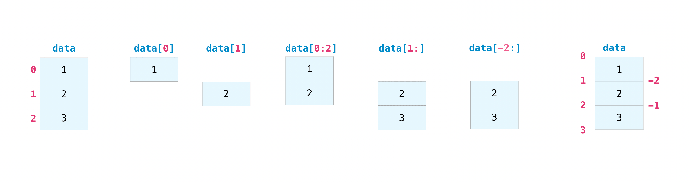

### 数组处理

```python
a = np.array([[1 , 2, 3, 4], [5, 6, 7, 8], [9, 10, 11, 12]])
print(a[a < 5])
# [1 2 3 4]

divisible_by_2 = a[a%2==0]
print(divisible_by_2)
# [ 2  4  6  8 10 12]

five_up = (a > 5) | (a == 5)
print(five_up)
#[[False False False False]
# [ True  True  True  True]
# [ True  True  True True]]

a = np.array([[1, 2, 3, 4], [5, 6, 7, 8], [9, 10, 11, 12]])
b = np.nonzero(a < 5)
# print(b)
# (array([0, 0, 0, 0]), array([0, 1, 2, 3]))

list_of_coordinates= list(zip(b[0], b[1]))

for coord in list_of_coordinates:
    print(coord)
# (0, 0)
# (0, 1)
# (0, 2)
# (0, 3)
```

### 从已有的数据创建数组

```python
a = np.array([1,  2,  3,  4,  5,  6,  7,  8,  9, 10])
arr1 = a[3:8]
arr1
# array([4, 5, 6, 7, 8])
```

```python
a1 = np.array([[1, 1],
               [2, 2]])

a2 = np.array([[3, 3],
               [4, 4]])
# 垂直堆叠               
np.vstack((a1, a2))
# array([[1, 1],
#        [2, 2],
#        [3, 3],
#        [4, 4]])

# 水平堆叠 
np.hstack((a1, a2))
# array([[1, 1, 3, 3],
#        [2, 2, 4, 4]])
```

```python
x = np.arange(1, 25).reshape(2, 12)
x
array([[ 1,  2,  3,  4,  5,  6,  7,  8,  9, 10, 11, 12],
       [13, 14, 15, 16, 17, 18, 19, 20, 21, 22, 23, 24]])

# 水平分割 
np.hsplit(x, 3)
#   [array([[ 1,  2,  3,  4],
#          [13, 14, 15, 16]]), array([[ 5,  6,  7,  8],
#          [17, 18, 19, 20]]), array([[ 9, 10, 11, 12],
#          [21, 22, 23, 24]])]

# 对数组 x 进行水平分割，分割点为索引位置 3 和 4
# 第一个子数组包含 x 的前三列（索引 0、1、2）。
# 第二个子数组包含 x 的第四列（索引 3）。
# 第三个子数组包含 x 的从第五列开始的所有列（索引 4、5、...）。
np.hsplit(x, (3, 4))
#   [array([[ 1,  2,  3],
#          [13, 14, 15]]), array([[ 4],
#          [16]]), array([[ 5,  6,  7,  8,  9, 10, 11, 12],
#          [17, 18, 19, 20, 21, 22, 23, 24]])]
```

### 广播机制

```python
# 不用遍历每个数字，运算直接作用于数组的每个元素
data = np.array([1.0, 2.0])
data * 1.6
# array([1.6, 3.2])
```

### 运算

- 零矩阵：`np.zeros()`

- 单位矩阵：`np.eye()`

- 矩阵乘法（叉乘）： `np.dot(A, B)`

- 矩阵点乘（对应元素相乘）：`A*B` or `np.multiply(A,B)`

- 矩阵求逆：`np.linalg.inv(A)`

- 矩阵转置：`A.T`

- 行列式计算：`det_A = np.linalg.det(A)`

- 矩阵的秩：`rank_M = np.linalg.matrix_rank(M)`

- 线性方程求解

  ```python
  A = np.array([[1, 2, 3],
                [4, 5, 6],
                [7, 8, 9]])
  b = np.array([6, 15, 24])
  
  # 求解线性方程组 Ax = b
  x = np.linalg.solve(A, b)
  print(x)
  ```

> 函数好多，我不想再复制乐

## 总结版

> 或许前面根本不用讲

### 创建数组

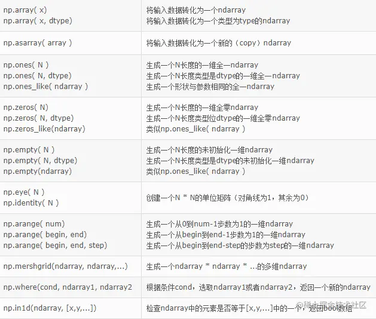

### 矩阵相关

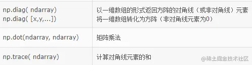

### 排序相关


### 一元计算函数

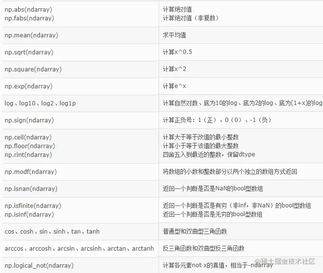

### 多元计算函数

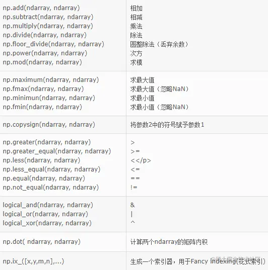

### 与文件读写相关的函数

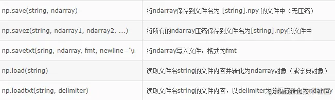

### 数组形状、属性相关

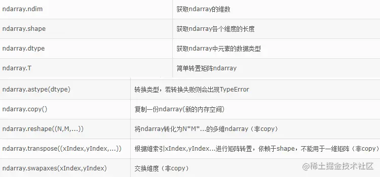

### 常用计算函数

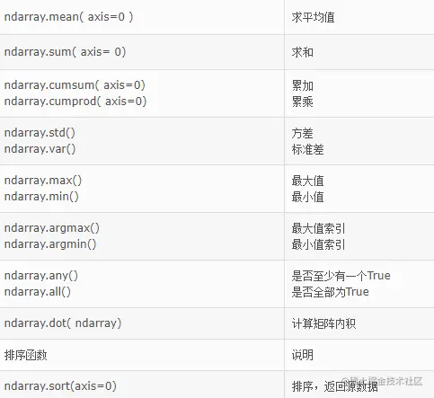

### 数组选取：切片和索引

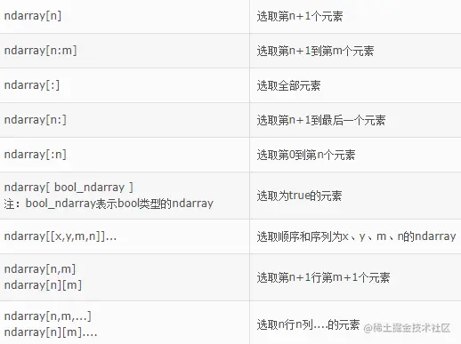

### np.random相关函数

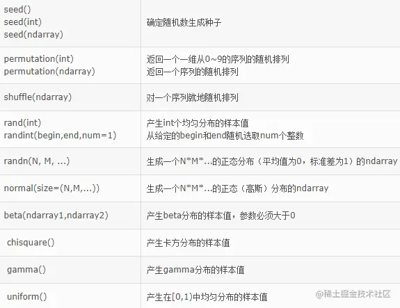

### np.linalg相关函数

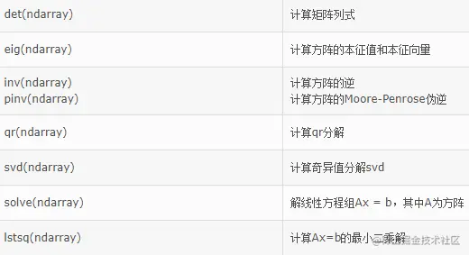

# Matplotlib

> 绘图用的

## 案例引入

高中物理考试的描点作图题，如果是线性关系的话要作出一条大概穿过所有描点的直线。现在我们可以用`matplotlib`画。

### 问题

如图，作出W和U的关系图：

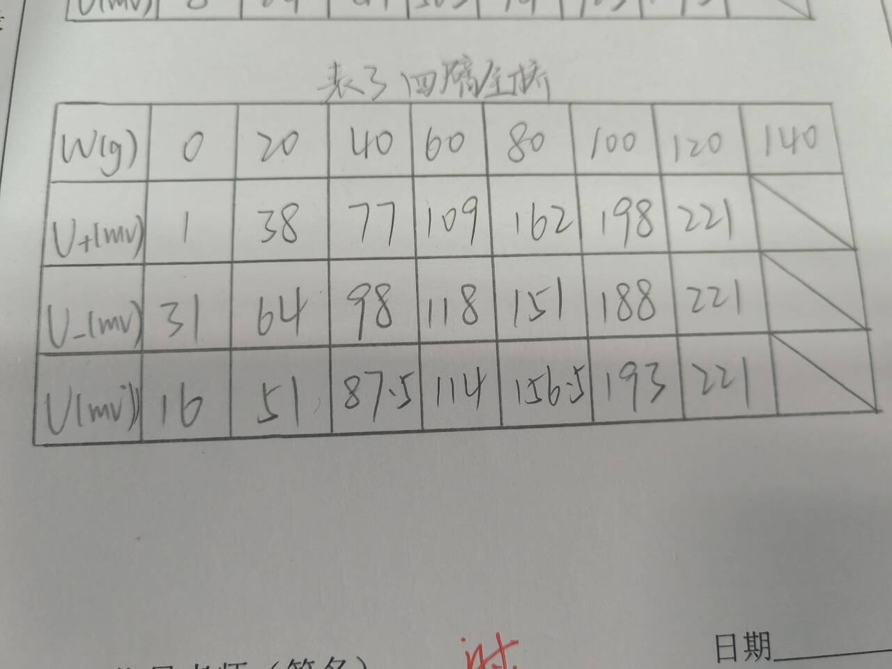

### 代码

```python
# 导入必要的包
import matplotlib.pyplot as plt
import numpy as np

# 输入数据
x = np.array([0, 20, 40, 60, 80, 100, 120])
y = np.array([16, 51, 87.5, 114, 156.5, 193, 221])

# 绘制散点图
plt.scatter(x, y, color='black')

# 使用polyfit拟合一次多项式
coefficients = np.polyfit(x, y, 1)
m, b = coefficients

# 生成拟合曲线上的点
fit_x = np.linspace(min(x), max(x), 100)
fit_y = m * fit_x + b

# 绘制拟合曲线
plt.plot(fit_x, fit_y, color='black')

# 在右上角显示拟合公式，微调位置
fit_formula = f'y = {m:.2f}x + {b:.2f}'
plt.text(0.65, 0.9, fit_formula, ha='center', va='center', transform=plt.gca().transAxes)
# (0.65, 0.9) 的值表示文本将位于 x 轴的 65% 和 y 轴的 90% 处


# 添加图例和标签
plt.legend()
plt.xlabel('W(g)')
plt.ylabel('U(mv)')
plt.title("四臂全桥", fontproperties="SimHei", fontsize=26) # SimHei前提是有这个字体，默认的字体不支持中文

# 保存图片
plt.savefig('plot.png')

# 显示图形
plt.show()
```

### 结果

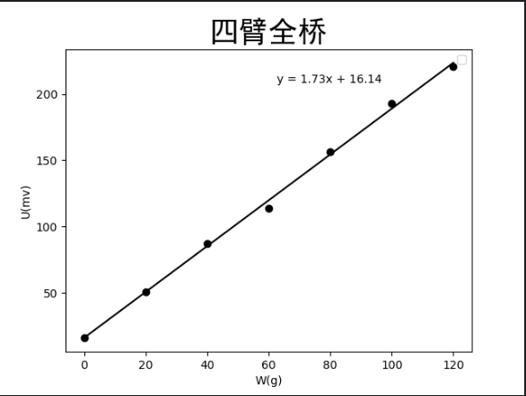

如果你的电脑运行出来了一堆红色报错，加上这句或许可以：

```python
import matplotlib
matplotlib.use('TkAgg')
```

> `TkAgg` 是一种后端，它使用 Tkinter 库创建一个图形用户界面（GUI）窗口来显示图表

## 使用

### 展示图片

```python
import matplotlib.pyplot as plt
# 当你想看图片的时候必须加上这句
plt.show()
```

### 根据坐标作图

```python
import matplotlib.pyplot as plt

# 只有一组数会默认为y轴数值，x轴默认从0开始（0,1,2...）
plt.plot([1, 2, 3, 4])
# 给y轴加标签
plt.ylabel('some numbers')
plt.show()
```

```python
# 默认第一个是x轴，第二个是y轴
plt.plot([1, 2, 3, 4], [1, 4, 9, 16])
```

### 设置坐标轴边界

```python
plt.plot([1, 2, 3, 4], [1, 4, 9, 16], 'ro')
# 'ro' 表示使用红色的圆点（'r' 表示红色，'o' 表示圆点）

# x轴范围从0到6 y轴范围从0到20
plt.axis((0, 6, 0, 20))
plt.show()
```

### 描点形状

```python
import numpy as np

# 看前面
t = np.arange(0., 5., 0.2)

# red dashes, blue squares and green triangles
# 红色虚线 蓝色正方形 绿色三角形
# t**3 将数组的每个数值进行三次方运算
plt.plot(t, t, 'r--', t, t**2, 'bs', t, t**3, 'g^')
plt.show()
```

### 散点图

```python
data = {'a': np.arange(50),                         
        # 创建一个字典 data，包含键 'a'，值为 0 到 49 的数组
        'c': np.random.randint(0, 50, 50),          
        # 键 'c' 对应的值是一个包含 50 个随机整数的数组，范围在 0 到 49 之间
        'd': np.random.randn(50)}                   
		# 键 'd' 对应的值是一个包含 50 个随机标准正态分布的数组

data['b'] = data['a'] + 10 * np.random.randn(50)     
# 创建一个键 'b'，对应的值是键 'a' 的值加上一个服从均值为 0，标准差为 10 的正态分布数组

data['d'] = np.abs(data['d']) * 100                  
# 将键 'd' 对应的值取绝对值，并乘以 100

plt.scatter('a', 'b', c='c', s='d', data=data)       
# 绘制散点图，x 轴使用键 'a' 对应的值，y 轴使用键 'b' 对应的值，颜色使用键 'c' 对应的值，大小使用键 'd' 对应的值
plt.xlabel('entry a')                               
# 设置 x 轴标签为 'entry a'
plt.ylabel('entry b')                               
# 设置 y 轴标签为 'entry b'
plt.show()                                          
# 显示图形
```

### 分组绘图

```python
names = ['group_a', 'group_b', 'group_c']     
# 创建一个包含三个字符串元素的列表 names
values = [1, 10, 100]                        
# 创建一个包含三个整数元素的列表 values

plt.figure(figsize=(9, 3))                    
# 创建一个图形对象，设置图形的尺寸为宽度 9 英寸，高度 3 英寸

plt.subplot(131)                              
# 创建一个 1x3 的子图网格，并激活第一个子图
plt.bar(names, values)                        
# 在第一个子图上绘制柱状图，x 轴为 names，y 轴为 values

plt.subplot(132)                              
# 激活第二个子图
plt.scatter(names, values)                    
# 在第二个子图上绘制散点图，x 轴为 names，y 轴为 values

plt.subplot(133)                              
# 激活第三个子图
plt.plot(names, values)                       
# 在第三个子图上绘制折线图，x 轴为 names，y 轴为 values

plt.suptitle('Categorical Plotting')          
# 设置整个图形的标题为 'Categorical Plotting'
plt.show()                                    
# 显示图形
```

### 折线设置

这里x和y都直接替代了numpy数组，如果要运行的话需要提前定义

```python
# 线宽
plt.plot(x, y, linewidth=2.0)
```

```python
# '-' 表示绘制直线状的折线
line, = plt.plot(x, y, '-')
# line.set_antialiased(False) 调用线对象的 set_antialiased 方法，将抗锯齿效果设置为关闭。
# 抗锯齿是一种图形渲染技术，用于减少锯齿边缘的出现，让图形看起来更加平滑。
line.set_antialiased(False)
```

```python
lines = plt.plot(x1, y1, x2, y2)
# use keyword arguments
plt.setp(lines, color='r', linewidth=2.0)
# or MATLAB style string value pairs
plt.setp(lines, 'color', 'r', 'linewidth', 2.0)
# plt.setp 函数用于批量设置对象的属性。
# 这里将 lines 列表中的所有线对象的颜色设置为红色 (color='r')，线宽设置为 2.0 (linewidth=2.0)。
```

### 多个子图

```python
def f(t):
    return np.exp(-t) * np.cos(2*np.pi*t)

t1 = np.arange(0.0, 5.0, 0.1)
t2 = np.arange(0.0, 5.0, 0.02)

plt.figure()
plt.subplot(211)
plt.plot(t1, f(t1), 'bo', t2, f(t2), 'k')

plt.subplot(212)
plt.plot(t2, np.cos(2*np.pi*t2), 'r--')
plt.show()
```

- `def f(t):`：这是一个定义函数 `f(t)` 的代码块，该函数返回通过计算公式 `np.exp(-t) * np.cos(2*np.pi*t)` 得到的值。这个函数在后面的代码中被用来生成曲线的 y 坐标。
- `t1 = np.arange(0.0, 5.0, 0.1)`：这行代码创建一个从 0.0 到 5.0 的数组 `t1`，步长为 0.1，用于生成第一个子图的 x 坐标。
- `t2 = np.arange(0.0, 5.0, 0.02)`：这行代码创建一个从 0.0 到 5.0 的数组 `t2`，步长为 0.02，用于生成第二个子图的 x 坐标。
- `plt.figure()`：创建一个图形对象。
- `plt.subplot(211)`：创建一个 2 行 1 列的子图网格，并激活第一个子图。
- `plt.plot(t1, f(t1), 'bo', t2, f(t2), 'k')`：在第一个子图中使用蓝色圆点标记 `'bo'` 绘制折线图，其中 x 坐标为 `t1`，y 坐标为 `f(t1)`；然后使用黑色线条 `'k'` 绘制折线图，其中 x 坐标为 `t2`，y 坐标为 `f(t2)`。
- `plt.subplot(212)`：激活第二个子图。
- `plt.plot(t2, np.cos(2*np.pi*t2), 'r--')`：在第二个子图中使用红色虚线 `'r--'` 绘制折线图，其中 x 坐标为 `t2`，y 坐标为 `np.cos(2*np.pi*t2)`。

### 加入文本

```python
mu, sigma = 100, 15
x = mu + sigma * np.random.randn(10000)

# the histogram of the data
n, bins, patches = plt.hist(x, 50, density=True, facecolor='g', alpha=0.75)


plt.xlabel('Smarts')
plt.ylabel('Probability')
plt.title('Histogram of IQ')
plt.text(60, .025, r'$\mu=100,\ \sigma=15$')
plt.axis([40, 160, 0, 0.03])
plt.grid(True)
plt.show()
```

- `mu, sigma = 100, 15`：定义了两个变量 `mu` 和 `sigma`，分别表示数据的均值和标准差。
- `x = mu + sigma * np.random.randn(10000)`：生成一个包含 10000 个随机数的数组 `x`，这些随机数服从均值为 `mu`，标准差为 `sigma` 的正态分布。
- `n, bins, patches = plt.hist(x, 50, density=True, facecolor='g', alpha=0.75)`：使用 `plt.hist` 函数创建直方图，并将返回的计数、边界值和直方图对象分别赋值给变量 `n`、`bins` 和 `patches`。直方图将数据 `x` 分成 50 个箱子，并绘制出来。`density=True` 表示将频率标准化为概率密度，`facecolor='g'` 表示直方图的颜色为绿色，`alpha=0.75` 表示设置透明度为 0.75。
- `plt.xlabel('Smarts')`：设置 x 轴标签为 'Smarts'。
- `plt.ylabel('Probability')`：设置 y 轴标签为 'Probability'。
- `plt.title('Histogram of IQ')`：设置图形标题为 'Histogram of IQ'。
- `plt.text(60, .025, r'$\mu=100,\ \sigma=15$')`：在图形中添加文本说明。文本内容为 `$\mu=100,\ \sigma=15$`，位于坐标 (60, .025) 处。
- `plt.axis([40, 160, 0, 0.03])`：设置坐标轴的显示范围。x 轴的范围为 40 到 160，y 轴的范围为 0 到 0.03。
- `plt.grid(True)`：显示网格线。

### 非线性作图

```python
import matplotlib.pyplot as plt
import numpy as np
from scipy.interpolate import interp1d

# 输入数据
x = np.array(
    [-75, -70, -65, -60, -55, -50, -45, -40, -35, -30, -25, -20, -15, -10, -5, 0, 5, 10, 15, 20, 25, 30, 35, 40, 45, 50,
     55, 60, 65, 70, 75])
y = np.array(
    [2.2, 2.3, 2.5, 3.0, 3.6, 4.4, 5.6, 7.2, 9.6, 12.1, 16.2, 19.6, 23.0, 26.2, 28.3,  29.4, 29.3, 27.8, 25.5,
     21.5, 17.9, 13.4, 10.4, 7.9, 5.9, 4.6, 3.7, 3.1, 2.7, 2.3, 2.1])

# 使用interp1d进行线性插值
f = interp1d(x, y, kind='cubic')  # 'cubic' 表示三次样条插值，也可以选择 'linear' 等

# 生成插值曲线上的点
smooth_x = np.linspace(min(x), max(x), 100)
smooth_y = f(smooth_x)

# 绘制散点图
plt.scatter(x, y, color='black')

# 绘制插值曲线
plt.plot(smooth_x, smooth_y, color='black')

# 添加图例和标签
plt.legend()
plt.xlabel('角度', fontproperties="SimHei")
plt.ylabel('对比度', fontproperties="SimHei")
plt.title("水平方向视角特性", fontproperties="SimHei", fontsize=26)

# 保存图形
plt.savefig('plot5.png')

# 显示图形
plt.show()
```

# 作业

1. 把代码自己运行一遍
1. 安装Anaconda
1. 敬情期待

# 参考文档

numpy：https://numpy.org/doc/1.24/user/absolute_beginners.html

matplotlib：https://matplotlib.org/stable/tutorials/pyplot.html#sphx-glr-tutorials-pyplot-py

img： https://juejin.cn/post/6971685902989033503

> 如果感觉很多的话，只要记得你可以进行哪些操作（有哪些函数），当你想用的时候来找一下就行了。后面我们会经常用到，也可以跟着慢慢熟悉。