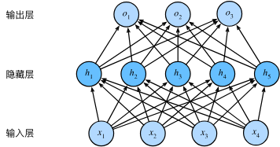
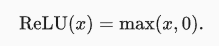
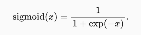

# Anaconda

> 就目前来说装不装都行，不影响这节课

## **python和包以及anaconda的概念关系**

基于自己对于这些概念术语之间的关系打一个小比方：

- **关于python与包**

包 =“工具”；

下载包 = “买工具”；

写程序 = "用工具做东西"（程序import导入）

- **关于anaconda**

环境 = "好比一栋楼，在楼里面分配一间屋给各种‘包’放，每间房里面的‘包’互不影响"

激活环境 = “告诉电脑，我现在要用这个屋子里面的‘包’来做东西了所以要进这间屋子”

移除环境 = “现在这个屋子里面我原来要用的东西现在不需要了把它赶出去节省电脑空间”

`Conda`创建环境相当于创建一个虚拟的空间将这些包都装在这个位置，我不需要了可以直接打包放入垃圾箱，同时也可以针对不同程序的运行环境选择不同的`conda`虚拟环境进行运行。

**例如：**

`env1`装了`pytorch1.0`，`env2`装了`pytorch1.2`，需要使用1.0的时候激活`env1`，需要使用`pytorch`版本1.2的时候激活`env2`，这样就不用每次配环境一个一个包重新安装。

> 丢一个链接，课下找时间详细学习一下，即使没安装的话手动切换版本也是ok的 
>
> https://cloud.tencent.com/developer/article/1975317

# 机器学习

本来准备主要讲理论，但是里面的数学公式太多，我怕讲完下节课就没人了。所以就减少了理论部分，很多只是了解层面的。

## 机器学习与深度学习

区别：

1. 方法和模型复杂度：机器学习方法通常基于统计学和模式识别等原理，使用各种算法和模型来从数据中学习规律和模式。深度学习是机器学习的一个**子领域**，它专注于使用多层神经网络模型来学习更高级的抽象特征表示，可以处理更复杂的数据和任务。
2. 特征工程：在传统机器学习中，通常需要手动进行特征工程，即**从原始数据中提取和选择合适的特征**。而在深度学习中，神经网络可以**自动从原始数据中学习特征表示**，减少了对手动特征工程的依赖。
3. 数据需求：深度学习通常需要**大量的训练数据**来获得良好的性能，特别是在处理复杂任务时。机器学习方法相对而言**对数据量的要求较低**，但仍需要足够的数据进行模型训练。

联系：

1. 数据驱动：机器学习和深度学习都是数据驱动的方法，它们通过从数据中学习模式和规律来进行预测、分类或其他任务。
2. 模型训练：无论是机器学习还是深度学习，模型训练都是通过优化目标函数来调整模型参数，以最小化预测结果与真实标签之间的误差。这涉及到使用训练数据进行模型优化的过程。
3. 应用领域：机器学习和深度学习都在各种领域得到广泛应用，如计算机视觉、自然语言处理、语音识别、推荐系统等。它们可以用于解决分类、回归、聚类、生成等各种机器学习任务。
4. 结合使用：机器学习和深度学习并非相互排斥，而是可以结合使用。深度学习可以作为机器学习的一种工具或方法之一，用于处理特别复杂的任务，而机器学习方法可以用于处理数据较少或较简单的情况。

过程：


## 线性神经网络

### 感知器

为了理解神经网络，我们应该先理解神经网络的组成单元——**神经元**。神经元也叫做**感知器**。


一个感知器由如下组成部分：

(1) **输入权值** 一个感知器可以接收多个输入：

[](https://cuijiahua.com/wp-content/uploads/2018/10/dl-7-4.png)

每个输入上有一个**权值**：

[](https://cuijiahua.com/wp-content/uploads/2018/10/dl-7-5.png)

此外还有一个**偏置项**：

[](https://cuijiahua.com/wp-content/uploads/2018/10/dl-7-6.png)

就是上图中的w0。

(2) **激活函数** 感知器的激活函数可以有很多选择，比如我们可以选择下面这个**阶跃函数f**来作为激活函数：

[](https://cuijiahua.com/wp-content/uploads/2018/10/dl-7-7.png)

(3) **输出** 感知器的输出由下面这个公式来计算：

[](https://cuijiahua.com/wp-content/uploads/2018/10/dl-7-8-1.png)

如果看完上面的公式一下子就晕了，不要紧，我们用一个简单的例子来帮助理解。

### 训练一个与函数

| x1   | x2   | y    |
| ---- | ---- | ---- |
| 0    | 0    | 0    |
| 0    | 1    | 0    |
| 1    | 0    | 0    |
| 1    | 1    | 1    |

我们令：

[](https://cuijiahua.com/wp-content/uploads/2018/10/dl-7-10.png)

而激活函数就f是前面写出来的**阶跃函数**，这时，感知器就相当于**and**函数。不明白？我们验算一下：

输入上面真值表的第一行，即x1=0；x2=0，那么根据公式(1)，计算输出：

[](https://cuijiahua.com/wp-content/uploads/2018/10/dl-7-11.png)

也就是当x1x2都为0的时候，y为0，这就是**真值表**的第一行。

**获得权重项和偏置项**

感知器训练算法：将权重项和偏置项初始化为0，然后，利用下面的**感知器规则**迭代的修改wi和b，直到训练完成。

[](https://cuijiahua.com/wp-content/uploads/2018/10/dl-7-16.png)

其中:

[](https://cuijiahua.com/wp-content/uploads/2018/10/dl-7-17.png)

wi是与输入xi对应的权重项，b是偏置项。事实上，可以把b看作是值永远为1的输入xb所对应的权重。t是训练样本的**实际值**，一般称之为**label**。而y是感知器的输出值，它是根据**公式(1)**计算得出。η是一个称为**学习速率**的常数，其作用是控制每一步调整权的幅度。

每次从训练数据中取出一个样本的输入向量x，使用感知器计算其输出y，再根据上面的规则来调整权重。每处理一个样本就调整一次权重。经过多轮迭代后（即全部的训练数据被反复处理多轮），就可以训练出感知器的权重，使之实现目标函数。

```python
# 感知器训练学习
from functools import reduce


class Perceptron:
    def __init__(self, input_num, activator):
        """
        初始化感知器，设置输入参数的个数，以及激活函数。
        激活函数的类型为double -> double
        :param input_num: 输入参数的个数
        :param activator: 激活函数，接受一个double类型的输入，返回一个double类型的输出
        """
        self.activator = activator
        # 权重向量初始化为0
        # 用来存储感知器模型的权重参数。权重参数决定了每个输入特征对感知器输出的影响程度。
        # [0.0 for _ in range(input_num)] 这部分代码使用了列表推导式来创建一个包含
        # input_num 个元素的列表，并将每个元素初始化为0.0。这就构成了初始的权重向量
        self.weights = [0.0 for _ in range(input_num)]
        # 偏置项初始化为0
        self.bias = 0.0

    def __str__(self):
        """
        打印学习到的权重、偏置项
        :return: 学习到的权重和偏置项的字符串表示
        """
        return 'weights\t:%s\nbias\t:%f\n' % (self.weights, self.bias)

    def predict(self, input_vec):
        """
        输入向量，输出感知器的计算结果
        :param input_vec: 输入向量
        :return: 感知器的计算结果
        """
        # 把input_vec[x1,x2,x3...]和weights[w1,w2,w3,...]打包在一起
        # 变成[(x1,w1),(x2,w2),(x3,w3),...]
        # 然后利用map函数计算[x1*w1, x2*w2, x3*w3]
        # 最后利用reduce求和
        return self.activator(
            reduce(lambda a, b: a + b, list(map(lambda x, w: x * w, input_vec, self.weights)), 0.0) + self.bias)

    # iteration 是指训练迭代的次数
    def train(self, input_vecs, labels, iteration, rate):
        """
        输入训练数据：一组向量、与每个向量对应的label；以及训练轮数、学习率
        :param input_vecs: 输入向量的列表
        :param labels: 对应的标签列表
        :param iteration: 训练轮数
        :param rate: 学习率
        """
        for i in range(iteration):
            self._one_iteration(input_vecs, labels, rate)

    def _one_iteration(self, input_vecs, labels, rate):
        """
        一次迭代，把所有的训练数据过一遍
        :param input_vecs: 输入向量的列表
        :param labels: 对应的标签列表
        :param rate: 学习率
        """
        # 把输入和输出打包在一起，成为样本的列表[(input_vec, label), ...]
        # 而每个训练样本是(input_vec, label)
        samples = zip(input_vecs, labels)
        # 对每个样本，按照感知器规则更新权重
        for (input_vec, label) in samples:
            # 计算感知器在当前权重下的输出
            output = self.predict(input_vec)
            # 更新权重
            self._update_weights(input_vec, output, label, rate)

    def _update_weights(self, input_vec, output, label, rate):
        """
        按照感知器规则更新权重
        :param input_vec: 输入向量
        :param output: 感知器的输出
        :param label: 实际标签
        :param rate: 学习率
        """
        # 把input_vec[x1,x2,x3,...]和weights[w1,w2,w3,...]打包在一起
        # 变成[(x1,w1),(x2,w2),(x3,w3),...]
        # 然后利用感知器规则更新权重
        delta = label - output
        # 新权重 = 旧权重 + 学习率 * 误差 * 输入特征
        self.weights = list(map(lambda x, w: w + rate * delta * x, input_vec, self.weights))
        # 新偏置项 = 旧偏置项 + 学习率 * 误差
        self.bias += rate * delta
        print("权重更新辣")
        print(self.weights)
        print(self.bias)


def f(x):
    """
    定义激活函数f
    :param x: 输入值
    :return: 激活函数的输出值
    """
    return 1 if x > 0 else 0


def get_training_dataset():
    """
    基于and真值表构建训练数据
    :return: 输入向量列表和对应的标签列表
    """
    # 构建训练数据
    # 输入向量列表
    input_vecs = [[1, 1], [0, 0], [1, 0], [0, 1]]
    # 期望的输出列表，注意要与输入一一对应
    # [1,1] -> 1, [0,0] -> 0, [1,0] -> 0, [0,1] -> 0
    labels = [1, 0, 0, 0]
    return input_vecs, labels


def train_and_perceptron():
    """
    使用and真值表训练感知器
    :return: 训练好的感知器对象
    """
    # 创建感知器，输入参数个数为2（因为and是二元函数），激活函数为f
    p = Perceptron(2, f)
    # 训练，迭代10轮, 学习速率为0.1
    input_vecs, labels = get_training_dataset()
    p.train(input_vecs, labels, 10, 0.1)
    # 返回训练好的感知器
    return p


if __name__ == '__main__':
    # 训练and感知器
    and_perception = train_and_perceptron()
    # 打印训练获得的权重
    print(and_perception)
    # 测试
    print('1 and 1 = %d' % and_perception.predict([1, 1]))
    print('0 and 0 = %d' % and_perception.predict([0, 0]))
    print('1 and 0 = %d' % and_perception.predict([1, 0]))
    print('0 and 1 = %d' % and_perception.predict([0, 1]))
```

> 你可能已经看晕了，但是没办法，我们必须理解好这个才能往下走。

**感知器**可以被看作是机器学习中的一种基础模型，特别是在二分类问题中，它可以用于判断一个样本属于哪个类别。虽然感知器相对简单，但它展示了机器学习的几个重要概念和步骤:

1. 数据准备：与其他机器学习模型一样，使用感知器前需要准备训练数据。数据应该包括输入特征和对应的标签或类别，以便模型能够学习输入特征与输出之间的关系。
2. 特征权重和偏置项初始化：感知器的核心是为每个输入特征分配一个权重，并设置一个偏置项。初始时，可以随机初始化这些权重和偏置项。
3. 预测输出：对于给定的输入特征，感知器将计算加权和，并通过阈值函数（如阶跃函数）将结果映射到预测输出。这个预测输出可以被视为二分类的预测结果。
4. 计算损失：将感知器的预测输出与真实标签进行比较，计算损失或误差。常用的损失函数是均方误差（Mean Squared Error）或交叉熵损失（Cross Entropy Loss），具体选择取决于任务类型。
5. 参数更新：使用优化算法（如梯度下降），根据损失函数的梯度来调整感知器的权重和偏置项，以减小损失。这个过程被称为参数更新或模型训练。
6. 重复训练：重复进行步骤3到5，直到达到停止条件。停止条件可以是达到一定的训练轮数、达到一定的精度要求或损失函数收敛等。
7. 预测和评估：训练完成后，使用感知器对新样本进行预测，并评估模型的性能。常用的评估指标包括准确率、精确率、召回率和F1分数等。

> 这是与函数的图形化表示，我们通过跃阶函数将这条线的上方区域转化成1,下方转化称成0。
>
> 
>
> 但是通过这个感知器，你无法实现以下的函数，异或函数（相同得0,不同得1），因为你找不到一条直线可以把圆形和叉分在两边。
>
> 

### 线性回归

- 多输入，一输出

- 和上面的模型差不多


### softmax回归

- 多输入，多输出

- 多用于解决分类问题


## 多层感知机

- 大部分问题不是线性的，所以添加一个隐藏层，更易于捕捉到输入之间复杂的相互作用，表示更复杂的模型
- 隐藏层也可以不只一个，可以用更深的网络，可能更易于逼近一些函数



### 激活函数

*激活函数*（activation function）通过计算加权和并加上偏置来确定神经元是否应该被激活， 它们将输入信号转换为输出的可微运算。

> 实际上，每一层的输入都可以用激活函数，但是要根据情况去选择。

#### ReLU函数

ReLU函数通过将相应的活性值设为0，仅保留正元素并丢弃所有负元素。 

使用ReLU的原因是，它求导表现得特别好：要么让参数消失，要么让参数通过。




#### Sigmoid函数

*sigmoid函数*将输入变换为区间(0, 1)上的输出。 因此，sigmoid通常称为*挤压函数*（squashing function）： 它将范围（-inf, inf）中的任意输入压缩到区间（0, 1）中的某个值：

它是一个平滑的、可微的阈值单元近似。 当我们想要将输出视作二元分类问题的概率时， sigmoid仍然被广泛用作**输出**单元上的激活函数 （sigmoid可以视为softmax的特例）。 




## 深度学习框架

深度学习框架是用于构建、训练和部署深度学习模型的软件工具集合。它们提供了一种方便的方式来定义、优化和执行神经网络模型。以下是一些常见的深度学习框架：

1. TensorFlow：由Google开发的最受欢迎的开源深度学习框架之一。它具有强大的灵活性和高性能，并支持在多种平台上进行部署，包括移动设备和大规模分布式系统。

   https://www.tensorflow.org/guide/eager?hl=zh-cn

2. PyTorch：由Facebook开发的深度学习框架，它提供了动态图计算的能力，使得模型的定义和调试变得更加直观。PyTorch还被广泛用于研究领域，因为它具有良好的可扩展性和易用性。

   https://pytorch.org/tutorials/

3. Keras：Keras是一个高级神经网络API，它**可以运行在多个深度学习框架**上，**包括TensorFlow、PyTorch**等。Keras的设计目标是提供简单易用的接口，使得快速原型设计和实验变得更加容易。

还有一个框架是paddlepaddle：https://www.paddlepaddle.org.cn/tutorials/projectdetail/5603475

> 我怀疑以上三个在我们今后的学习中都会用到，为什么呢？
>
> 因为你想在网上抄别人的模型来运行，他大概率用的是tensorflow或者pytorch，你要是不会的话可能都抄不明白。

我们的学习几乎要基于example，也就是不用自己写完整代码，只要能看懂，会改代码就行了。

接下来我们感受一下，顺便看看代码：

## 深度学习实战

### 图像分类

pytorch官网的quick start , 先尝试自己运行

#### Pytorch

```bash
pip install torch # 或者
```

```bash
conda install torch # anaconda环境下
```

**代码**

```python
import torch
from torch import nn
from torch.utils.data import DataLoader
from torchvision import datasets
from torchvision.transforms import ToTensor
import matplotlib.pyplot as plt

# 下载训练数据和测试数据
training_data = datasets.FashionMNIST(
    root="data",
    train=True,
    download=True,
    transform=ToTensor(),
)

test_data = datasets.FashionMNIST(
    root="data",
    train=False,
    download=True,
    transform=ToTensor(),
)

batch_size = 64

# 加载数据
train_dataloader = DataLoader(training_data, batch_size=batch_size)
test_dataloader = DataLoader(test_data, batch_size=batch_size)

# 获取第一批次的图像和标签
images, labels = next(iter(test_dataloader))
# 获取第一张图像
image = images[0]
label = labels[0]
# 将图像的形状从 [C, H, W] 转换为 [H, W, C]
image = image.permute(1, 2, 0)
# 将标签转换为对应的类别名称
class_names = [
    "T-shirt/top",
    "Trouser",
    "Pullover",
    "Dress",
    "Coat",
    "Sandal",
    "Shirt",
    "Sneaker",
    "Bag",
    "Ankle boot"
]
class_name = class_names[label]
# 显示图像
plt.imshow(image)
plt.title(class_name)
plt.axis('off')
plt.show()

for X, y in test_dataloader:
    print(f"Shape of X [N, C, H, W]: {X.shape}")  # 打印输入数据 X 的形状
    print(f"Shape of y: {y.shape} {y.dtype}")  # 打印标签数据 y 的形状和数据类型
    break  # 仅打印一次后退出循环

# 获取用于训练的CPU、GPU或MPS设备
device = (
    "cuda"
    if torch.cuda.is_available()
    else "mps"
    if torch.backends.mps.is_available()
    else "cpu"
)
print(f"Using {device} device")


# 定义模型
class NeuralNetwork(nn.Module):
    def __init__(self):
        """
        神经网络模型的初始化函数。

        参数：
            无输入参数。

        输出：
            无输出，用于初始化神经网络模型的各个层。

        """
        super().__init__()

        # 将输入数据展平
        self.flatten = nn.Flatten()

        # 定义线性层和激活函数的堆叠
        self.linear_relu_stack = nn.Sequential(
            nn.Linear(28 * 28, 512),  # 输入大小为 28 * 28，输出大小为 512
            nn.ReLU(),  # ReLU 激活函数
            nn.Linear(512, 512),  # 输入大小为 512，输出大小为 512
            nn.ReLU(),  # ReLU 激活函数
            nn.Linear(512, 10)  # 输入大小为 512，输出大小为 10
        )

    def forward(self, x):
        """
        神经网络模型的前向传播函数。

        参数：
            x (torch.Tensor): 输入数据。

        输出：
            logits (torch.Tensor): 模型的预测结果（未经过激活函数）。

        """
        # 展平输入数据
        x = self.flatten(x)

        # 通过线性层和激活函数的堆叠进行前向传播
        logits = self.linear_relu_stack(x)

        return logits


model = NeuralNetwork().to(device)  # 创建神经网络模型实例，并将其移动到指定的设备上（如 CPU 或 GPU）
print(model)  # 打印神经网络模型的结构

loss_fn = nn.CrossEntropyLoss()  # 定义损失函数为交叉熵损失函数
optimizer = torch.optim.SGD(model.parameters(), lr=1e-3)  # 定义优化器为随机梯度下降（SGD），学习率为 0.001


def train(dataloader, model, loss_fn, optimizer):
    """
    对给定的数据加载器进行训练，更新模型的参数。

    参数：
        dataloader (torch.utils.data.DataLoader): 数据加载器，用于加载训练数据集。
        model (torch.nn.Module): 神经网络模型。
        loss_fn (torch.nn.Module): 损失函数，用于计算预测结果与真实标签之间的损失。
        optimizer (torch.optim.Optimizer): 优化器，用于更新模型的参数。

    输出：
        无返回值，用于训练和更新模型。

    """
    size = len(dataloader.dataset)  # 数据集的大小
    model.train()  # 设置模型为训练模式
    for batch, (X, y) in enumerate(dataloader):  # 遍历数据加载器中的每个批次
        X, y = X.to(device), y.to(device)  # 将输入数据和标签移动到指定的设备上（如 CPU 或 GPU）

        # 计算预测误差
        pred = model(X)  # 前向传播，获取模型的预测结果
        loss = loss_fn(pred, y)  # 计算预测结果与真实标签之间的损失

        # 反向传播和优化
        loss.backward()  # 反向传播，计算梯度
        optimizer.step()  # 根据梯度更新模型的参数
        optimizer.zero_grad()  # 清空梯度，准备处理下一个批次的数据。

        if batch % 100 == 0:  # 如果当前批次是第 100 的倍数（用于控制打印频率）
            loss, current = loss.item(), (batch + 1) * len(X)  # 获取当前批次的损失值和已处理的样本数。
            print(f"loss: {loss:>7f}  [{current:>5d}/{size:>5d}]")  # 打印当前批次的损失值和已处理的样本数。


def test(dataloader, model, loss_fn):
    """
    对给定的数据加载器进行测试，评估模型的性能。

    参数：
        dataloader (torch.utils.data.DataLoader): 数据加载器，用于加载测试数据集。
        model (torch.nn.Module): 神经网络模型。
        loss_fn (torch.nn.Module): 损失函数，用于计算预测结果与真实标签之间的损失。

    输出：
        无返回值，打印测试结果。

    """
    size = len(dataloader.dataset)  # 数据集的大小
    num_batches = len(dataloader)  # 批次的数量
    model.eval()  # 设置模型为评估模式，这将禁用一些特定于训练的操作，如 Dropout。
    test_loss, correct = 0, 0  # 初始化测试损失和正确预测的数量为0
    with torch.no_grad():  # 在评估模式下，不需要计算梯度，因此使用 torch.no_grad() 上下文管理器来加速运算。
        for X, y in dataloader:  # 遍历数据加载器中的每个批次
            X, y = X.to(device), y.to(device)  # 将输入数据和标签移动到指定的设备上（如 CPU 或 GPU）
            pred = model(X)  # 前向传播，获取模型的预测结果
            test_loss += loss_fn(pred, y).item()  # 累加当前批次的损失值
            correct += (pred.argmax(1) == y).type(torch.float).sum().item()  # 累加正确预测的数量
    test_loss /= num_batches  # 计算平均测试损失
    correct /= size  # 计算准确率
    print(f"Test Error: \n Accuracy: {(100 * correct):>0.1f}%, Avg loss: {test_loss:>8f} \n")


# 训练5轮，可以调整
epochs = 5
for t in range(epochs):
    print(f"Epoch {t + 1}\n-------------------------------")
    train(train_dataloader, model, loss_fn, optimizer)
    test(test_dataloader, model, loss_fn)
print("Done!")
```

#### Tensorflow

这个是tensorflow给的示例代码，主要在用其中的keras，先尝试自己运行起来。

**安装**

```bash
pip install tensorflow # 或者
```

```bash
conda install tensorflow # anaconda环境下
```

默认是2.14版本，官方文档也是基于2.14版本的，如果你在网上查教程，那很有可能运行不了。（所以如果在github上找别人的代码也可能要尝试回退版本才能运行）

这就突出了anaconda的好处，你可以在不同环境上装不同版本的，就不用每次pip来回调了（但同时也说明不安装anaconda也能正常“玩”）

```bash
pip install tensorflow == <版本号> # 回退版本
```

```bash
conda install tensorflow == <版本号> # anaconda环境下
```

##### 训练

```python
# TensorFlow and tf.keras
import matplotlib
import matplotlib.pyplot as plt
import numpy as np
import tensorflow as tf

# print(tf.__version__)

# 加载 Fashion MNIST 数据集
fashion_mnist = tf.keras.datasets.fashion_mnist
# 将数据集拆分为训练集和测试集
# 训练集包含用于训练模型的图像和标签
# 测试集包含用于评估模型性能的图像和标签
(train_images, train_labels), (test_images, test_labels) = fashion_mnist.load_data()

# 存储类名
class_names = ['T-shirt/top', 'Trouser', 'Pullover', 'Dress', 'Coat',
               'Sandal', 'Shirt', 'Sneaker', 'Bag', 'Ankle boot']

# 训练集中有 60,000 个图像，每个图像由 28 x 28 的像素表示
print(train_images.shape)
#  (60000, 28, 28)

# 训练集有60000个标签
print(train_labels)
print(len(train_labels))
# 60000

# 测试集中有 10,000 个图像。同样，每个图像都由 28x28 个像素
print(test_images.shape)
print(len(test_labels))

# 预处理
plt.figure()  # 创建一个新的图形（图表）窗口
plt.imshow(train_images[9])  # 在图表上显示train_images中索引为9的图像
plt.colorbar()  # 添加一个颜色条，用于显示图像中颜色对应的数值
plt.grid(False)  # 不显示网格线
plt.show()  # 显示图表窗口

# 将这些值缩小至 0 到 1 之间，然后将其馈送到神经网络模型。
train_images = train_images / 255.0

test_images = test_images / 255.0

# 为了验证数据的格式是否正确，以及您是否已准备好构建和训练网络，
# 让我们显示训练集中的前 25 个图像，并在每个图像下方显示类名称。
# 创建一个大小为 10x10 的图像窗口
plt.figure(figsize=(10, 10))

# 循环处理 25 个图像
for i in range(25):
    # 在 5x5 的子图中绘制当前图像
    plt.subplot(5, 5, i + 1)

    # 移除 x 轴和 y 轴的刻度
    plt.xticks([])
    plt.yticks([])

    # 关闭网格线
    plt.grid(False)

    # 显示当前训练集图像
    plt.imshow(train_images[i], cmap=plt.cm.binary)

    # 在图像下方显示标签类别名称
    plt.xlabel(class_names[train_labels[i]])

# 显示图像窗口
plt.show()

# 创建一个序列模型
model = tf.keras.Sequential([
    # 将输入数据展平为一维向量，输入形状为 (28, 28)
    tf.keras.layers.Flatten(input_shape=(28, 28)),
    # 添加一个具有 128 个神经元的全连接层，并使用 ReLU 激活函数
    tf.keras.layers.Dense(128, activation='relu'),
    # 添加一个具有 10 个神经元的全连接层，该层输出未经过激活的原始预测分数
    tf.keras.layers.Dense(10)
])

# 编译模型
model.compile(
    # 使用了Adam优化器，Adam是一种常用的优化算法，用于调整模型的权重以最小化损失函数。
    optimizer='adam',
    # 稀疏分类交叉熵损失函数。该损失函数适用于多类别分类问题，其中目标标签是整数形式（而不是独热编码）。
    # from_logits=True表示模型的输出是未经过概率分布转换的原始预测分数
    loss=tf.keras.losses.SparseCategoricalCrossentropy(from_logits=True),
    # 指定了评估模型性能的指标，即准确率。在训练过程中，模型将根据准确率指标来评估和监控其性能
    metrics=['accuracy'])

# 训练模型
# 向模型馈送数据
model.fit(train_images, train_labels, epochs=10)
model.save('image_classify.h5')
```

##### 测试

```python
# TensorFlow and tf.keras
import keras
import matplotlib
import matplotlib.pyplot as plt
import numpy as np
import tensorflow as tf

matplotlib.use('TkAgg')
# Helper libraries

# print(tf.__version__)

# 加载 Fashion MNIST 数据集
fashion_mnist = tf.keras.datasets.fashion_mnist
# 将数据集拆分为训练集和测试集
# 训练集包含用于训练模型的图像和标签
# 测试集包含用于评估模型性能的图像和标签
(train_images, train_labels), (test_images, test_labels) = fashion_mnist.load_data()

# 存储类名
class_names = ['T-shirt/top', 'Trouser', 'Pullover', 'Dress', 'Coat',
               'Sandal', 'Shirt', 'Sneaker', 'Bag', 'Ankle boot']

# 获取训练好的模型
model = keras.models.load_model('image_classify.h5')
# 评估准确率
# 控制输出信息详细程度的参数。当设置为2时，会显示每个测试样本的评估进度条和相关的指标
test_loss, test_acc = model.evaluate(test_images, test_labels, verbose=2)

print('\nTest accuracy:', test_acc)

# 进行预测
probability_model = tf.keras.Sequential([model,
                                         tf.keras.layers.Softmax()])

predictions = probability_model.predict(test_images)

print(predictions[0])

# 最有可能的
print(np.argmax(predictions[0]))

# 答案
print(test_labels[0])


def plot_image(i, predictions_array, true_label, img):
    true_label, img = true_label[i], img[i]
    plt.grid(False)
    plt.xticks([])
    plt.yticks([])

    plt.imshow(img, cmap=plt.cm.binary)

    predicted_label = np.argmax(predictions_array)
    if predicted_label == true_label:
        color = 'blue'
    else:
        color = 'red'

    plt.xlabel("{} {:2.0f}% ({})".format(class_names[predicted_label],
                                         100 * np.max(predictions_array),
                                         class_names[true_label]),
               color=color)


def plot_value_array(i, predictions_array, true_label):
    true_label = true_label[i]
    plt.grid(False)
    plt.xticks(range(10))
    plt.yticks([])
    thisplot = plt.bar(range(10), predictions_array, color="#777777")
    plt.ylim([0, 1])
    predicted_label = np.argmax(predictions_array)

    thisplot[predicted_label].set_color('red')
    thisplot[true_label].set_color('blue')


# 验证预测结果
i = 0
plt.figure(figsize=(6, 3))
plt.subplot(1, 2, 1)
plot_image(i, predictions[i], test_labels, test_images)
plt.subplot(1, 2, 2)
plot_value_array(i, predictions[i], test_labels)
plt.show()

i = 12
plt.figure(figsize=(6, 3))
plt.subplot(1, 2, 1)
plot_image(i, predictions[i], test_labels, test_images)
plt.subplot(1, 2, 2)
plot_value_array(i, predictions[i], test_labels)
plt.show()

# Plot the first X test images, their predicted labels, and the true labels.
# Color correct predictions in blue and incorrect predictions in red.
num_rows = 5
num_cols = 3
num_images = num_rows * num_cols
plt.figure(figsize=(2 * 2 * num_cols, 2 * num_rows))
for i in range(num_images):
    plt.subplot(num_rows, 2 * num_cols, 2 * i + 1)
    plot_image(i, predictions[i], test_labels, test_images)
    plt.subplot(num_rows, 2 * num_cols, 2 * i + 2)
    plot_value_array(i, predictions[i], test_labels)
plt.tight_layout()
plt.show()

# 使用训练好的模型
# Grab an image from the test dataset.
img = test_images[1]

print(img.shape)

img = (np.expand_dims(img, 0))

print(img.shape)

predictions_single = probability_model.predict(img)

print(predictions_single)

plot_value_array(1, predictions_single[0], test_labels)
_ = plt.xticks(range(10), class_names, rotation=45)
plt.show()
```

# 理论

> 喜欢看理论，喜欢数学公式推导的看这本书：https://zh.d2l.ai/chapter_linear-networks/linear-regression.html#id5

这里是一些需要了解的名词：

- 数据集
- 训练集
- 标签
- 特征
- 权重
- 偏置
- 损失函数
- 梯度下降
- 优化算法
- 神经网络
- ...

## 梯度下降


### 随机梯度下降

