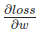
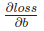

> 我们这学期进程差不多过半了，不管前面学的怎么样，希望大家能够每周坚持学下去。接下来的内容可能会越来越难以理解，代码也越来越复杂，但是我们一定要耐心，尝试看懂和运行代码，为后面的学习打好基础。

# Pytorch

这节课主要讲pytorch

官网：https://pytorch.org/tutorials/

## Tensors（张量）

1. **张量的定义：**
   - 张量是一种专门的数据结构，类似于数组和矩阵。
   - 在PyTorch中，我们使用张量来表示模型的输入、输出以及模型的参数。
2. **与NumPy的ndarrays比较：**
   - 张量**类似于NumPy的ndarrays**，但具有额外的功能。
   - 张量可以在GPU或其他硬件加速器上运行，适用于高性能计算。
   - 张量和NumPy数组通常可以**共享相同的底层内存**，减少了数据复制的需求。
3. **自动微分的优化：**
   - PyTorch中的张量**经过优化，以支持自动微分**，这是训练神经网络的关键功能。

### 导入

```python
import torch
import numpy as np
```

### 初始化

```python
# 1.从数据创建
data = [[1, 2],[3, 4]]
x_data = torch.tensor(data)

# 2.从numpy数组创建
np_array = np.array(data)
x_np = torch.from_numpy(np_array)

# 3.通过其他张量
x_ones = torch.ones_like(x_data) # 保留 x_data 的属性生成全为1的张量
print(f"Ones Tensor: \n {x_ones} \n")

x_rand = torch.rand_like(x_data, dtype=torch.float)  # 以 x_data 的形状生成随机张量，数据类型为浮点型
print(f"Random Tensor: \n {x_rand} \n")

# 4.用随机数或常量生成
shape = (2,3,)
rand_tensor = torch.rand(shape)
ones_tensor = torch.ones(shape)
zeros_tensor = torch.zeros(shape)

print(f"Random Tensor: \n {rand_tensor} \n")
print(f"Ones Tensor: \n {ones_tensor} \n")
print(f"Zeros Tensor: \n {zeros_tensor}")
```

### Attributes（属性）

```python
tensor = torch.rand(3,4)

print(f"Shape of tensor: {tensor.shape}") # 形状
print(f"Datatype of tensor: {tensor.dtype}") # 数据类型
print(f"Device tensor is stored on: {tensor.device}") # 运行设备
```

### Operations（操作/运算）

#### 索引和切片

```python
tensor = torch.ones(4, 4)
print(f"First row: {tensor[0]}")
print(f"First column: {tensor[:, 0]}") # ：表示选择所有行
print(f"Last column: {tensor[..., -1]}") #  ...表示选择所有维度
# 
tensor[:,1] = 0
print(tensor)
```

##### ...用法

```python
import torch

# 创建一个形状为 (2, 3, 4) 的三维张量
tensor = torch.rand((2, 3, 4))

# 打印整个张量
print("整个张量:")
print(tensor)

# 使用 ... 选择所有维度，然后在最后一个维度上选择索引为 0 的元素
print("\n选择所有维度，在最后一个维度上选择索引为 0 的元素:")
print(tensor[..., 0])

# 使用 ... 选择所有维度，然后在第一个维度上选择索引为 1 的元素
print("\n选择所有维度，在第一个维度上选择索引为 1 的元素:")
print(tensor[1, ...])

# 使用 ... 选择所有维度，然后在最后两个维度上选择索引为 1 的元素
print("\n选择所有维度，在最后两个维度上选择索引为 1 的元素:")
print(tensor[..., 1, :])

# 使用 ... 选择所有维度，然后在所有维度上选择索引为 2 的元素
print("\n选择所有维度，在所有维度上选择索引为 2 的元素:")
print(tensor[..., 2, ...])
```

```text
结果：
整个张量:
tensor([[[0.7019, 0.9208, 0.7413, 0.0088],
         [0.3529, 0.7969, 0.0020, 0.7115],
         [0.2048, 0.6801, 0.7618, 0.5144]],

        [[0.4658, 0.0168, 0.5788, 0.8986],
         [0.5671, 0.1865, 0.3982, 0.0427],
         [0.6546, 0.1579, 0.8733, 0.0659]]])

选择所有维度，在最后一个维度上选择索引为 0 的元素:
tensor([[0.7019, 0.3529, 0.2048],
        [0.4658, 0.5671, 0.6546]])

选择所有维度，在第一个维度上选择索引为 1 的元素:
tensor([[0.4658, 0.0168, 0.5788, 0.8986],
        [0.5671, 0.1865, 0.3982, 0.0427],
        [0.6546, 0.1579, 0.8733, 0.0659]])

选择所有维度，在最后两个维度上选择索引为 1 的元素:
tensor([[0.3529, 0.7969, 0.0020, 0.7115],
        [0.5671, 0.1865, 0.3982, 0.0427]])

选择所有维度，在所有维度上选择索引为 2 的元素:
tensor([[0.7413, 0.0020, 0.7618],
        [0.5788, 0.3982, 0.8733]])
```

- :表示选择所有元素，...表示省略了若干个:

#### 连接

```python
import torch

tensor = torch.ones(4, 4)
tensor[:, 1] = 2
t1 = torch.cat([tensor, tensor, tensor], dim=1)
print(t1)

t2 = torch.stack([tensor, tensor], dim=0)
print(t2)
```

#### 算术运算

```python
import torch

tensor = torch.ones(4, 4)
tensor[:, 1] = 2
print(tensor)

# 这三个是一个意思 矩阵内积
y1 = tensor @ tensor.T # 矩阵内积
print(y1)
y2 = tensor.matmul(tensor.T)
print(y2)
y3 = torch.rand_like(y1)
torch.matmul(tensor, tensor.T, out=y3) # 将结果存储在预先创建的张量 y3 中
print(y3)

# 这三个是一个意思 逐元素相乘
z1 = tensor * tensor
print(z1)
z2 = tensor.mul(tensor) # 计算两个张量的元素-wise 乘法（逐元素相乘）
print(z2)
z3 = torch.rand_like(tensor)
torch.mul(tensor, tensor, out=z3)
print(z3)

```

#### 单个元素取值

```python
import torch

# 创建一个只包含一个元素的张量
tensor = torch.tensor([42])

# 使用 item() 方法将张量转换为 Python 数值
python_value = tensor.item()

print(f"Python 数值: {python_value}")

tensor = torch.ones(4, 4)
tensor[:, 1] = 2

agg = tensor.sum()
agg_item = agg.item()
print(agg_item, type(agg_item))
```

#### 原地操作

- 会直接影响原始张量

```python
import torch

tensor = torch.ones(4, 4)
tensor[:, 1] = 2

print(f"{tensor} \n")
tensor.t_()
print(tensor)
tensor.add_(5)
print(tensor)
tensor.sub_(2)
print(tensor)
tensor.mul_(5)
print(tensor)
tensor.div_(3)
print(tensor)

tensor_tmp = torch.zeros(4, 4)
tensor.copy_(tensor_tmp)
print(tensor)

# 一般都是以“_”结尾，还有很多，可以自己查找
```

> 官方不提倡使用

### Bridge with NumPy（桥接机制）

```python
# Tensor转化称numpy数组
import torch

t = torch.ones(5)
print(f"t: {t}")
n = t.numpy()
print(f"n: {n}")

# 共享内存
t.add_(1)
print(f"t: {t}")
print(f"n: {n}")
```

```python
# numpy转化成Tensor
n = np.ones(5)
t = torch.from_numpy(n)

np.add(n, 1, out=n)
print(f"t: {t}")
print(f"n: {n}")

# 共享内存
np.add(n, 1, out=n)
print(f"t: {t}")
print(f"n: {n}")
```

## Datasets & DataLoaders（数据集和数据加载器）

1. **`torch.utils.data.Dataset`：**
   - `Dataset` 是 PyTorch 中的一个抽象类，用于表示数据集。它存储样本及其相应的标签，并定义了抽象方法，例如 `__len__`（返回数据集的大小）和 `__getitem__`（根据索引获取样本）。
   - 用户可以通过继承 `Dataset` 类来创建自定义数据集，使得数据处理的代码更加模块化。
2. **`torch.utils.data.DataLoader`：**
   - `DataLoader` 是 PyTorch 中的一个实用工具，它封装了一个可迭代对象，用于对数据集进行迭代。它简化了批处理、数据加载和多线程处理等任务。
   - 通过将 `Dataset` 对象传递给 `DataLoader`，可以轻松地对数据集进行批处理，洗牌（shuffle）等操作。
3. **领域专用库提供的预加载数据集：**
   - PyTorch的领域专用库提供了一些预加载的数据集，如 FashionMNIST，这些数据集是 `torch.utils.data.Dataset` 的子类，并实现了与特定数据相关的功能。
   - 这些预加载数据集可用于原型设计和模型性能评估。
4. 可用的数据集：
   - 图像数据集：https://pytorch.org/vision/stable/datasets.html
   - 文本数据集：https://pytorch.org/text/stable/datasets.html
   - 音频数据集：https://pytorch.org/audio/stable/datasets.html

### Loading（加载数据集）

下面以Fashion-MNIST数据集为例：

```python
import torch
from torch.utils.data import Dataset
from torchvision import datasets
from torchvision.transforms import ToTensor
import matplotlib.pyplot as plt


training_data = datasets.FashionMNIST(
    root="data", # 存储路径
    train=True, # 选择训练集
    download=True, # 如果本地没有的话是否下载
    transform=ToTensor() # 用于将 PIL 图像或 NumPy 数组转换为 PyTorch 张量
)

test_data = datasets.FashionMNIST(
    root="data", # 存储路径
    train=False, # 选择验证集
    download=True, # 如果本地没有的话是否下载
    transform=ToTensor() # 用于将 PIL 图像或 NumPy 数组转换为 PyTorch 张量
)
```

### Iterating and Visualizing（迭代和可视化数据集）

```python
# 定义标签映射，将类别索引映射到类别名称
labels_map = {
    0: "T-Shirt",
    1: "Trouser",
    2: "Pullover",
    3: "Dress",
    4: "Coat",
    5: "Sandal",
    6: "Shirt",
    7: "Sneaker",
    8: "Bag",
    9: "Ankle Boot",
}

# 创建一个用于显示图像的画布
figure = plt.figure(figsize=(8, 8))
# 定义子图的行数和列数
cols, rows = 3, 3
# 循环生成子图并显示随机样本的图像和标签
for i in range(1, cols * rows + 1):
    # 随机选择一个训练样本的索引
    sample_idx = torch.randint(len(training_data), size=(1,)).item()
    # 获取图像和标签
    img, label = training_data[sample_idx]
    # 将子图添加到画布上
    figure.add_subplot(rows, cols, i)
    # 设置子图的标题为标签对应的类别名称
    plt.title(labels_map[label])
    # 不显示坐标轴
    plt.axis("off")
    # 显示图像
    plt.imshow(img.squeeze(), cmap="gray")
# 展示整个画布
plt.show()
```

### a Custom Dataset（创建个性化数据集）

当创建一个自定义的 `Dataset` 类时，通常需要实现三个核心函数：`__init__`、`__len__` 和 `__getitem__`。

```python
import os
import pandas as pd
from torchvision.io import read_image
from torch.utils.data import Dataset

class CustomImageDataset(Dataset):
    def __init__(self, annotations_file, img_dir, transform=None, target_transform=None):
        """
    	初始化函数，用于创建数据集对象。
    	参数:
    	- annotations_file (str): 包含图像标签信息的 CSV 文件路径。
    	- img_dir (str): 图像存储的目录路径。
    	- transform (callable, optional): 数据预处理函数，用于对图像进行处理。
    	- target_transform (callable, optional): 标签预处理函数，用于对标签进行处理。
    	"""
        # 从 CSV 文件中读取图像标签信息
        self.img_labels = pd.read_csv(annotations_file)
        # 图像存储的目录
        self.img_dir = img_dir
        # 数据预处理函数，用于对图像进行处理
        self.transform = transform
        # 标签预处理函数，用于对标签进行处理
        self.target_transform = target_transform
    def __len__(self):
        """
   		返回数据集的大小，即样本的数量。
   		返回:
   		- int: 数据集的大小。
   	 	"""
        # 返回数据集的大小，即样本的数量
        return len(self.img_labels)
    def __getitem__(self, idx):
        """
  		根据索引获取单个样本的图像和标签。
   	    参数:
    	- idx (int): 样本的索引。
    	返回:
    	- tuple: 包含图像和标签的元组。
    	"""
        # 根据索引获取单个样本的图像路径和标签
        # img_labels.iloc 是在 Pandas DataFrame 对象上使用的方法，用于按索引选择行。
        img_path = os.path.join(self.img_dir, self.img_labels.iloc[idx, 0])
        # 使用 torchvision 的 read_image 读取图像
        image = read_image(img_path)
        # 获取样本的标签
        label = self.img_labels.iloc[idx, 1]
        # 如果有图像预处理函数，则应用
        if self.transform:
            image = self.transform(image)
        # 如果有标签预处理函数，则应用
        if self.target_transform:
            label = self.target_transform(label)
        # 返回图像和标签
        return image, label
```

### Preparing（用DataLoaders准备数据）

1. **小批量处理**：
   - 通过 `DataLoader`，你可以轻松指定**小批量**的大小，使模型能够逐渐学习和更新，而不是一次性处理整个数据集。
2. **周期性洗牌**：
   - `DataLoader` 在每个 epoch 之后会**重新洗牌数据**，确保模型在每个周期中都看到数据的不同排列，有助于**降低过拟合**的风险。
3. **多进程数据加载**：
   - 通过设置 `num_workers` 参数，`DataLoader` 支持使用**多进程来加速数据加载**。这对于处理大型数据集和复杂的加载操作非常有用，可以显著提高数据加载的速度。

```python
from torch.utils.data import DataLoader

train_dataloader = DataLoader(training_data, batch_size=64, shuffle=True)
test_dataloader = DataLoader(test_data, batch_size=64, shuffle=True)
```

### Iterate（通过DataLoader迭代）

- 每次迭代都会返回一个包含 `batch_size=64` 个特征和标签的批次 (`train_features` 和 `train_labels` 分别包含批次大小的特征和标签)
- `shuffle=True`，在迭代完所有批次之后，数据将会被重新洗牌

```python
# 展示图形和标签
train_features, train_labels = next(iter(train_dataloader))
print(f"Feature batch shape: {train_features.size()}")
print(f"Labels batch shape: {train_labels.size()}")
img = train_features[0].squeeze()
label = train_labels[0]
plt.imshow(img, cmap="gray") # cmap颜色映射
plt.show()
print(f"Label: {label}")
```

## Transform（变换）

数据并不总是以适用于训练机器学习算法的最终处理形式出现。我们使用变换来对数据进行一些操作，使其适用于训练。

所有 TorchVision 数据集都具有两个参数

- `transform` 用于修改特征
- `target_transform` 用于修改标签

```python
import torch
from torchvision import datasets
from torchvision.transforms import ToTensor, Lambda

# FashionMNIST 的特征是 PIL 图像格式，标签是整数。对于训练，我们需要将特征转换为标准化的张量，将标签转换为 one-hot 编码的张量。为了进行这些转换，我们使用了 ToTensor 和 Lambda。

ds = datasets.FashionMNIST(
    root="data",
    train=True,
    download=True,
    transform=ToTensor(), # 将图像转换为 PyTorch 张量的标准变换
    # ToTensor 将 PIL 图像或 NumPy 数组转换为 FloatTensor，并将图像的像素强度值缩放到范围 [0., 1.]。（图片的像素值在0-255）
    target_transform=Lambda(lambda y: torch.zeros(10, dtype=torch.float).scatter_(0, torch.tensor(y), value=1))
    # 这是一个自定义的标签转换。对于每个标签 y，它创建了一个包含 10 个元素的零张量，然后使用 scatter_ 函数将标签的位置置为 1。这相当于对标签进行了 one-hot 编码
)
```

## BUILD（构建神经网络）

`torch.nn` 命名空间提供了构建自己的神经网络所需的所有构建块。在 PyTorch 中，每个模块都是 `nn.Module` 的子类。

```python
import os
import torch
from torch import nn
from torch.utils.data import DataLoader
from torchvision import datasets, transforms
```

### Get Device（获取设备）

```python
device = (
    "cuda"
    if torch.cuda.is_available()
    else "mps"
    if torch.backends.mps.is_available()
    else "cpu"
)
print(f"Using {device} device")
```

### Define the Class（定义类）

我们通过继承 `nn.Module` 类来定义神经网络，并在 `__init__` 中初始化神经网络的层。每个 `nn.Module` 的子类在 `forward` 方法中实现对输入数据的操作。

```python
class NeuralNetwork(nn.Module):
    def __init__(self):
        """
        初始化神经网络模型的结构。
        Layers:
        - Flatten 层: 将输入的二维图像数据展平为一维向量。
        - Sequential 层: 包含三个全连接层，每一层后跟一个 ReLU 激活函数。
        """
        super().__init__()

        # Flatten层：用于将输入的二维图像数据展平为一维向量
        self.flatten = nn.Flatten()

        # Sequential层：按照顺序组合多个层，形成一个模块
        self.linear_relu_stack = nn.Sequential(
            nn.Linear(28*28, 512),  # 全连接层，输入维度为28*28，输出维度为512
            nn.ReLU(),              # ReLU激活函数
            nn.Linear(512, 512),    # 全连接层，输入维度为512，输出维度为512
            nn.ReLU(),              # ReLU激活函数
            nn.Linear(512, 10),      # 全连接层，输入维度为512，输出维度为10
        )

    def forward(self, x):
        """
        定义了输入数据的前向传播过程。
        Args:
        - x: 输入数据，通常是二维图像数据。
        Returns:
        - logits: 模型的输出，未经过 softmax 的预测分数。
        """
        # 将输入数据展平
        x = self.flatten(x)
        # 将展平后的数据通过Sequential层进行前向传播
        logits = self.linear_relu_stack(x)
        # 返回模型的输出（logits）
        return logits
```

打印结构

```python
model = NeuralNetwork().to(device)
print(model)
```

>  不要直接调用 `model.forward()`

调用模型对输入进行预测会返回一个二维张量，其中 dim=0 对应于每个类别的 10 个原始预测值的输出，dim=1 对应于每个输出的单个值。

```python
# 创建一个形状为 (1, 28, 28) 的随机输入张量
X = torch.rand(1, 28, 28, device=device)
# 将输入张量传递给模型，获取模型的输出（logits）
logits = model(X)
# 使用 nn.Softmax 对输出进行 softmax 操作，得到预测的概率分布
pred_probab = nn.Softmax(dim=1)(logits)
# 取最大概率的索引，获得模型对输入的类别预测
y_pred = pred_probab.argmax(1)
# 打印预测的类别
print(f"Predicted class: {y_pred}")
```

`logits` 是模型对输入的原始输出，它提供了模型对每个类别的置信度分数。softmax 操作通常用于将这些分数转换为概率分布，以便更容易解释和使用。

### Model Layers（模型层）

分解一下 FashionMNIST 模型中的层次结构

取一个包含 3 张大小为 28x28 的图像的小批量样本

```python
# 创建一个包含 3 张大小为 28x28 的随机图像的小批量输入
input_image = torch.rand(3, 28, 28)

# 打印输入图像的大小
print(input_image.size())
# 输出: torch.Size([3, 28, 28])
```

#### nn.Flatten

```python
# 创建 Flatten 层
flatten = nn.Flatten()

# 将输入图像传递给 Flatten 层，进行展平操作
flat_image = flatten(input_image)

# 打印展平后的张量大小
print(flat_image.size())
# 输出: torch.Size([3, 784])
```

#### nn.Linear

```python
# 创建 Linear 层，指定输入特征数和输出特征数
layer1 = nn.Linear(in_features=28*28, out_features=20)

# 将展平后的图像数据传递给 Linear 层，进行线性变换
hidden1 = layer1(flat_image)

# 打印变换后的张量大小
print(hidden1.size())
# 输出: torch.Size([3, 20])
```

#### nn.ReLU

```python
# 在线性层之间使用 ReLU 进行非线性激活
print(f"Before ReLU: {hidden1}\n\n")
hidden1 = nn.ReLU()(hidden1)
print(f"After ReLU: {hidden1}")
"""
Before ReLU: tensor([[ 0.4158, -0.0130, -0.1144,  0.3960,  0.1476, -0.0690, -0.0269,  0.2690,
          0.1353,  0.1975,  0.4484,  0.0753,  0.4455,  0.5321, -0.1692,  0.4504,
          0.2476, -0.1787, -0.2754,  0.2462],
        [ 0.2326,  0.0623, -0.2984,  0.2878,  0.2767, -0.5434, -0.5051,  0.4339,
          0.0302,  0.1634,  0.5649, -0.0055,  0.2025,  0.4473, -0.2333,  0.6611,
          0.1883, -0.1250,  0.0820,  0.2778],
        [ 0.3325,  0.2654,  0.1091,  0.0651,  0.3425, -0.3880, -0.0152,  0.2298,
          0.3872,  0.0342,  0.8503,  0.0937,  0.1796,  0.5007, -0.1897,  0.4030,
          0.1189, -0.3237,  0.2048,  0.4343]], grad_fn=<AddmmBackward0>)


After ReLU: tensor([[0.4158, 0.0000, 0.0000, 0.3960, 0.1476, 0.0000, 0.0000, 0.2690, 0.1353,
         0.1975, 0.4484, 0.0753, 0.4455, 0.5321, 0.0000, 0.4504, 0.2476, 0.0000,
         0.0000, 0.2462],
        [0.2326, 0.0623, 0.0000, 0.2878, 0.2767, 0.0000, 0.0000, 0.4339, 0.0302,
         0.1634, 0.5649, 0.0000, 0.2025, 0.4473, 0.0000, 0.6611, 0.1883, 0.0000,
         0.0820, 0.2778],
        [0.3325, 0.2654, 0.1091, 0.0651, 0.3425, 0.0000, 0.0000, 0.2298, 0.3872,
         0.0342, 0.8503, 0.0937, 0.1796, 0.5007, 0.0000, 0.4030, 0.1189, 0.0000,
         0.2048, 0.4343]], grad_fn=<ReluBackward0>)
"""
```

#### nn.Sequential

`nn.Sequential` 是一个按顺序排列的模块容器。数据将按照定义的顺序通过所有模块。你可以使用 sequential 容器来快速搭建一个网络，就像 `seq_modules` 那样。

```python
# 定义一个包含多个模块的序列容器
seq_modules = nn.Sequential(
    flatten,
    layer1,
    nn.ReLU(),
    nn.Linear(20, 10)
)

# 创建输入图像
input_image = torch.rand(3, 28, 28)

# 通过序列容器进行前向传播
logits = seq_modules(input_image)
```

通过调用 `seq_modules(input_image)`，可以将输入图像传递给整个序列容器，实现了前向传播。这种方式使得定义和使用神经网络更加简洁。

#### nn.Softmax

神经网络的最后一个线性层返回 logits，即落在区间 [-infty, infty] 的原始值。这些 logits 会经过 `nn.Softmax` 模块，将它们缩放到 [0, 1] 的范围，表示模型对每个类别的预测概率。

`dim` 参数指定了沿着哪个维度进行 Softmax 操作，以确保在该维度上的值之和为 1。

```python
softmax = nn.Softmax(dim=1)
pred_probab = softmax(logits)
```

## Model Parameters（模型参数）

```python
print(f"Model structure: {model}\n\n")

for name, param in model.named_parameters():
    print(f"Layer: {name} | Size: {param.size()} | Values : {param[:2]} \n")

"""
Model structure: NeuralNetwork(
  (flatten): Flatten(start_dim=1, end_dim=-1)
  (linear_relu_stack): Sequential(
    (0): Linear(in_features=784, out_features=512, bias=True)
    (1): ReLU()
    (2): Linear(in_features=512, out_features=512, bias=True)
    (3): ReLU()
    (4): Linear(in_features=512, out_features=10, bias=True)
  )
)


Layer: linear_relu_stack.0.weight | Size: torch.Size([512, 784]) | Values : tensor([[ 0.0273,  0.0296, -0.0084,  ..., -0.0142,  0.0093,  0.0135],
        [-0.0188, -0.0354,  0.0187,  ..., -0.0106, -0.0001,  0.0115]],
       device='cuda:0', grad_fn=<SliceBackward0>)

Layer: linear_relu_stack.0.bias | Size: torch.Size([512]) | Values : tensor([-0.0155, -0.0327], device='cuda:0', grad_fn=<SliceBackward0>)

Layer: linear_relu_stack.2.weight | Size: torch.Size([512, 512]) | Values : tensor([[ 0.0116,  0.0293, -0.0280,  ...,  0.0334, -0.0078,  0.0298],
        [ 0.0095,  0.0038,  0.0009,  ..., -0.0365, -0.0011, -0.0221]],
       device='cuda:0', grad_fn=<SliceBackward0>)

Layer: linear_relu_stack.2.bias | Size: torch.Size([512]) | Values : tensor([ 0.0148, -0.0256], device='cuda:0', grad_fn=<SliceBackward0>)

Layer: linear_relu_stack.4.weight | Size: torch.Size([10, 512]) | Values : tensor([[-0.0147, -0.0229,  0.0180,  ..., -0.0013,  0.0177,  0.0070],
        [-0.0202, -0.0417, -0.0279,  ..., -0.0441,  0.0185, -0.0268]],
       device='cuda:0', grad_fn=<SliceBackward0>)

Layer: linear_relu_stack.4.bias | Size: torch.Size([10]) | Values : tensor([ 0.0070, -0.0411], device='cuda:0', grad_fn=<SliceBackward0>)
"""
```

## torch.autograd（自动微分）

在训练神经网络时，最常用的算法之一是反向传播。在这个算法中，根据损失函数相对于给定参数的梯度来调整参数（模型权重）。

为了计算这些梯度，PyTorch拥有一个内置的微分引擎，称为`torch.autograd`。它支持对任何计算图进行梯度的自动计算。

考虑最简单的单层神经网络，具有输入x、参数w和b，以及某个损失函数。可以用以下方式在PyTorch中定义它：

```python
import torch

x = torch.ones(5)  # 输入张量
y = torch.zeros(3)  # 期望输出
w = torch.randn(5, 3, requires_grad=True)
b = torch.randn(3, requires_grad=True)
z = torch.matmul(x, w)+b
loss = torch.nn.functional.binary_cross_entropy_with_logits(z, y)
```

- `loss = torch.nn.functional.binary_cross_entropy_with_logits(z, y)`: 使用二元交叉熵损失函数计算模型输出 `z` 与期望输出 `y` 之间的损失。这个损失函数通常在二分类问题中使用。

### 张量（Tensors）、函数（Functions）和计算图（Computational Graph）

上图的计算图：


在这个网络中，w和b是需要优化的参数。因此，我们需要能够计算损失函数相对于这些变量的梯度。为了实现这一点，我们设置这些张量的 `requires_grad` 属性。

- 反向传播函数的引用存储在张量的 `grad_fn` 属性中。

```python
print(f"Gradient function for z = {z.grad_fn}")
print(f"Gradient function for loss = {loss.grad_fn}")
```

### Computing Gradients（梯度计算）

为了优化神经网络中的参数权重，我们需要计算损失函数相对于参数的导数，即计算：





```python
loss.backward()
print(w.grad)
print(b.grad)
"""
tensor([[0.3049, 0.2117, 0.2346],
        [0.3049, 0.2117, 0.2346],
        [0.3049, 0.2117, 0.2346],
        [0.3049, 0.2117, 0.2346],
        [0.3049, 0.2117, 0.2346]])
tensor([0.3049, 0.2117, 0.2346])
"""
```

- 只能获取计算图的叶节点的 `grad` 属性，这些节点的 `requires_grad` 属性设置为 `True`。对于计算图中的所有其他节点，梯度将不可用。
- 在同一图上进行多次 `backward` 调用，需要在 `backward` 调用中传递 `retain_graph=True`。

### Disabling Gradient Tracking（禁用梯度跟踪）

```python
z = torch.matmul(x, w)+b
print(z.requires_grad)

with torch.no_grad():
    z = torch.matmul(x, w)+b
print(z.requires_grad)

# True
# False
```

- **默认情况**下，所有 `requires_grad=True` 的张量都会追踪它们的计算历史并支持梯度计算。
- 已经训练好模型，只想将其应用于一些输入数据时，即我们只想通过网络进行**前向计算**。我们可以通过使用 `torch.no_grad()` 块来停止跟踪计算过程。

另一种实现相同结果的方法是使用张量的 `detach()` 方法：

```python
z = torch.matmul(x, w)+b
z_det = z.detach()
print(z_det.requires_grad)
```


禁用梯度跟踪的原因可能有以下几点：

1. 将神经网络中的某些参数标记为**冻结参数**。
2. 在只进行前向传播时**加快计算速度**，因为不跟踪梯度的张量上的计算会更有效率。

> 后面部分我也看不懂，省略了。

## OPTIMIZING MODEL PARAMETERS（优化模型参数）

训练模型是一个迭代的过程；在每次迭代中，模型对输出进行猜测，计算其猜测的错误（损失），收集关于其参数的错误导数（正如我们在前面部分中看到的），然后使用梯度下降优化这些参数。

### Prerequisite Code（先决条件代码）

加载数据和构建模型

```python
import torch
from torch import nn
from torch.utils.data import DataLoader
from torchvision import datasets
from torchvision.transforms import ToTensor

training_data = datasets.FashionMNIST(
    root="data",
    train=True,
    download=True,
    transform=ToTensor()
)

test_data = datasets.FashionMNIST(
    root="data",
    train=False,
    download=True,
    transform=ToTensor()
)

train_dataloader = DataLoader(training_data, batch_size=64)
test_dataloader = DataLoader(test_data, batch_size=64)

class NeuralNetwork(nn.Module):
    def __init__(self):
        super().__init__()
        self.flatten = nn.Flatten()
        self.linear_relu_stack = nn.Sequential(
            nn.Linear(28*28, 512),
            nn.ReLU(),
            nn.Linear(512, 512),
            nn.ReLU(),
            nn.Linear(512, 10),
        )

    def forward(self, x):
        x = self.flatten(x)
        logits = self.linear_relu_stack(x)
        return logits

model = NeuralNetwork()
```

### Hyperparameters（超参数）

```python
learning_rate = 1e-3
batch_size = 64
epochs = 5
```

- 训练轮数（Epochs） - 在整个数据集上迭代的次数。

- 批处理大小（Batch Size） - 在更新参数之前通过网络传播的数据样本数。

- 学习率（Learning Rate） - 在每个批次/轮次中更新模型参数的程度。较小的值会导致学习速度较慢，而较大的值可能在训练过程中产生不可预测的行为。

### Optimization Loop（优化循环）

一旦我们设置了超参数，就可以使用优化循环来训练和优化模型。优化循环的每个迭代被称为一个轮次（epoch）。

每个轮次包含两个主要部分：

1. **训练循环** - 遍历训练数据集并尝试收敛到最佳参数。
2. **验证/测试循环** - 遍历测试数据集以检查模型性能是否有所提升。

### Loss Function（损失函数）

损失函数度量了获得的结果与目标值之间的**不相似程度**，而在训练过程中我们希望最小化损失函数。为了计算损失，我们使用模型对给定数据样本的输入进行预测，并将其与**真实数据标签值进行比较**。

常见的损失函数包括用于回归任务的 nn.MSELoss（均方误差），以及用于分类的 nn.NLLLoss（负对数似然）。nn.CrossEntropyLoss 结合了 nn.LogSoftmax 和 nn.NLLLoss。

```python
# 初始化损失函数
loss_fn = nn.CrossEntropyLoss()
```

### Optimizer（优化器）

优化是调整模型参数以**在每个训练步骤中减少模型误差**的过程。优化算法定义了如何执行这个过程。在这里，我们使用 SGD 优化器；此外，PyTorch 中还有**许多不同的优化器**，如 ADAM 和 RMSProp，它们针对不同类型的模型和数据表现更好。

```python
# 初始化优化器
optimizer = torch.optim.SGD(model.parameters(), lr=learning_rate)
```

在训练循环中，优化分为三个步骤：

1. 调用 `optimizer.zero_grad()` 来重置模型参数的梯度。梯度默认会累积；为了**防止重复计算**，我们在每次迭代时**显式将它们清零**。
2. 通过调用 `loss.backward()` **反向传播预测损失**。PyTorch 存储了损失相对于每个参数的梯度。
3. 一旦得到梯度，我们调用 `optimizer.step()` 来**根据反向传播中收集的梯度调整参数**。

我们定义了`train_loop`，它循环执行优化代码，以及`test_loop`，它评估模型在测试数据上的性能。

### Full Implementation（完整实现）

我们定义了一个`train_loop`，该循环遍历我们的优化代码，并且一个`test_loop`，用于评估模型在测试数据上的性能。

```python
import torch

def train_loop(dataloader, model, loss_fn, optimizer):
    size = len(dataloader.dataset)
    # 将模型设置为训练模式 - 对于批量归一化和丢弃层很重要
    # 在这种情况下不是必需的，但为了最佳实践而添加
    model.train()
    for batch, (X, y) in enumerate(dataloader):
        # 计算预测和损失
        pred = model(X)
        loss = loss_fn(pred, y)

        # 反向传播
        loss.backward()
        optimizer.step()
        optimizer.zero_grad()

        if batch % 100 == 0:
            loss, current = loss.item(), (batch + 1) * len(X)
            print(f"损失：{loss:>7f}  [{current:>5d}/{size:>5d}]")

def test_loop(dataloader, model, loss_fn):
    # 将模型设置为评估模式 - 对于批量归一化和丢弃层很重要
    # 在这种情况下不是必需的，但为了最佳实践而添加
    model.eval() # 评估模式
    size = len(dataloader.dataset)
    num_batches = len(dataloader)
    test_loss, correct = 0, 0

    # 使用torch.no_grad()评估模型，确保在测试模式下不计算梯度
    # 同时减少对requires_grad=True张量的不必要梯度计算和内存使用
    with torch.no_grad(): 
        for X, y in dataloader:
            pred = model(X)
            test_loss += loss_fn(pred, y).item()
            correct += (pred.argmax(1) == y).type(torch.float).sum().item()

    test_loss /= num_batches
    correct /= size
    print(f"测试错误：\n 准确率：{(100*correct):>0.1f}%，平均损失：{test_loss:>8f} \n")
```

我们初始化损失函数和优化器，并将它们传递给`train_loop`和`test_loop`。请随意增加轮数以跟踪模型性能的提高。

```python
import torch.nn as nn
import torch.optim as optim

# 使用交叉熵损失函数
loss_fn = nn.CrossEntropyLoss()
# 使用随机梯度下降优化器，学习率为learning_rate
optimizer = torch.optim.SGD(model.parameters(), lr=learning_rate)
# 设置训练的轮数
epochs = 10
for t in range(epochs):
    print(f"Epoch {t+1}\n-------------------------------")    
    # 训练循环
    train_loop(train_dataloader, model, loss_fn, optimizer)    
    # 测试循环
    test_loop(test_dataloader, model, loss_fn)
print("Done!")
```

# SAVE AND LOAD THE MODEL（保存和加载模型）

```python
import torch
import torchvision.models as models
```

## Saving and Loading Model Weights（保存和加载模型参数）

PyTorch 模型将学到的参数存储在一个内部状态字典中，称为 `state_dict`。这些参数可以通过 `torch.save` 方法进行持久化保存：

```python
model = models.vgg16(weights='IMAGENET1K_V1')
torch.save(model.state_dict(), 'model_weights.pth')
```

为了加载模型权重，你需要首先创建同一模型的实例，然后使用 `load_state_dict()` 方法加载参数。

```python
# 创建一个未经训练的VGG16模型实例，不指定权重
model = models.vgg16()
# 加载预训练的模型权重
model.load_state_dict(torch.load('model_weights.pth'))
# 将模型设置为评估模式
model.eval()
```

## Saving and Loading Models with Shapes（保存和加载带有形状的模型）

在加载模型权重时，我们需要首先实例化模型类，因为类定义了网络的结构。如果我们想要将类的结构与模型一起保存，那么我们可以将模型（而不是`model.state_dict()`）传递给保存函数：

```python
torch.save(model, 'model.pth')
```

加载：

```python
model = torch.load('model.pth')
# 需要先对model初始化（用之前模型的那个类，可以用from...import...导入），然后才能加载
```

# Pytorch实战

相信通过上面的拆解分析，同学们应该了解了如何用pytorch写一个完整的训练过程，那么上次课的作业应该就比较简单了。

## y=x1方+x2方

```python
import torch
from torch import nn
from torch.optim import SGD
from torch.utils.data import Dataset, DataLoader


class CustomDataset(Dataset):
    def __init__(self, num_samples=1000):
        torch.manual_seed(42)
        self.X = (torch.rand((num_samples, 2)) - 0.5) * 10.0
        self.y = self.X[:, 0] ** 2 + self.X[:, 1] ** 2

    def __len__(self):
        return len(self.X)

    def __getitem__(self, idx):
        return self.X[idx], self.y[idx]


# 创建自定义数据集实例和数据加载器
custom_dataset = CustomDataset()
data_loader = DataLoader(dataset=custom_dataset, batch_size=32, shuffle=True)


# 定义模型
class Model(nn.Module):
    def __init__(self):
        super(Model, self).__init__()
        self.linear1 = nn.Linear(2, 128)
        self.relu = nn.ReLU()
        self.linear2 = nn.Linear(128, 64)
        self.linear3 = nn.Linear(64, 1)

    def forward(self, x):
        x = self.linear1(x)
        x = self.relu(x)
        x = self.linear2(x)
        x = self.relu(x)
        return self.linear3(x)


# 初始化模型、损失函数和优化器
model = Model()
criterion = nn.MSELoss()
optimizer = SGD(model.parameters(), lr=0.001)
torch.nn.utils.clip_grad_norm_(model.parameters(), max_norm=1)

# 训练模型
num_epochs = 2000
for epoch in range(num_epochs):
    for inputs, labels in data_loader:
        # 前向传播
        outputs = model(inputs)
        loss = criterion(outputs.squeeze(), labels)
        # 反向传播和优化
        optimizer.zero_grad()
        loss.backward()
        optimizer.step()

    if (epoch + 1) % 100 == 0:
        print(f'Epoch [{epoch + 1}/{num_epochs}], Loss: {loss.item():.4f}')

# 使用训练后的模型进行预测
with torch.no_grad():
    new_data = torch.tensor([[0., 2.]])
    prediction = model(new_data)
    print(f'Prediction for {new_data}: {prediction.item():.4f}')
```

> 我就随便调了一下，同学们也可以有不一样的网络结构和超参数，可能效果比我的还好

> 由于模型较为简单，没有涉及验证集，同学们如果有兴趣也可以补写出来

## Covid-19预测

线性回归模型预测：

> 代码和数据集都在课程目录下

```python
tr_path = 'covid.train.csv'  # path to training data
tt_path = 'covid.test.csv'  # path to testing data

# pytorch
import torch
import torch.nn as nn
from torch.utils.data import Dataset, DataLoader

# 数据处理
import numpy as np
import csv
import os

# 绘图
import matplotlib.pyplot as plt
from matplotlib.pyplot import figure

myseed = 42069  # 设置随机种子（random seed）以确保结果的可重复性
torch.backends.cudnn.deterministic = True  # 设置 PyTorch 中的 cuDNN 以确保结果的可重复性
torch.backends.cudnn.benchmark = False  # 关闭 cuDNN 的自动优化，以确保结果的可重复性
np.random.seed(myseed)  # 设置 NumPy 中的随机种子
torch.manual_seed(myseed)  # 设置 PyTorch 中的随机种子
if torch.cuda.is_available():  # 如果 GPU 可用，设置 GPU 中的随机种子
    torch.cuda.manual_seed_all(myseed)


def get_device():
    """ 获取设备 """
    return 'cuda' if torch.cuda.is_available() else 'cpu'


def plot_learning_curve(loss_record, title=''):
    """
    绘制神经网络的学习曲线（训练集和验证集的损失曲线）
    参数:
    - loss_record (dict): 包含训练集和验证集损失记录的字典
                         格式: {'train': [train_loss_1, train_loss_2, ...], 'dev': [dev_loss_1, dev_loss_2, ...]}
    - title (str): 图表标题，默认为空字符串
    返回:
    无，直接显示学习曲线图
    """
    total_steps = len(loss_record['train'])
    x_1 = range(total_steps)
    # 使得 x_2 与 x_1 的长度相同，以便对齐训练集和验证集的损失值
    x_2 = x_1[::len(loss_record['train']) // len(loss_record['dev'])]
    # 创建图表，设置大小
    figure(figsize=(6, 4))
    # 绘制训练集损失曲线，使用红色（tab:red）表示
    plt.plot(x_1, loss_record['train'], c='tab:red', label='train')
    # 绘制验证集损失曲线，使用青色（tab:cyan）表示
    plt.plot(x_2, loss_record['dev'], c='tab:cyan', label='dev')
    # 设置 y 轴范围
    plt.ylim(0.0, 5.)
    # 设置 x 轴和 y 轴标签
    plt.xlabel('Training steps')
    plt.ylabel('MSE loss')
    # 设置图表标题
    plt.title('Learning curve of {}'.format(title))
    # 显示图例
    plt.legend()
    # 显示图表
    plt.show()


def plot_pred(dv_set, model, device, lim=35., preds=None, targets=None):
    """
    绘制神经网络的预测结果图
    参数:
    - dv_set (DataLoader): 验证集的数据加载器
    - model (NeuralNet): 已训练的神经网络模型
    - device (str): 指定设备，可选 'cuda' 或 'cpu'
    - lim (float): x、y轴的范围限制，默认为35.0
    - preds (numpy array): 模型预测的结果，可选，如果提供则不重新计算
    - targets (numpy array): 真实标签，可选，如果提供则不重新获取
    返回:
    无，直接显示预测结果图
    """
    if preds is None or targets is None:
        # 如果未提供预测结果或真实标签，则重新计算
        model.eval()  # 将模型设置为评估模式
        preds, targets = [], []
        # 遍历验证集的数据加载器
        for x, y in dv_set:
            x, y = x.to(device), y.to(device)  # 将输入数据和真实标签移动到指定的设备
            with torch.no_grad():
                # 在这个上下文中关闭梯度计算，提高计算效率
                pred = model(x)  # 通过模型进行前向传播，得到预测结果
                preds.append(pred.detach().cpu())  # 将预测结果添加到 preds 列表中
                targets.append(y.detach().cpu())  # 将真实标签添加到 targets 列表中
        # 将所有预测结果沿第一个维度拼接成一个 NumPy 数组
        preds = torch.cat(preds, dim=0).numpy()
        # 将所有真实标签沿第一个维度拼接成一个 NumPy 数组
        targets = torch.cat(targets, dim=0).numpy()
    # 创建图表，设置大小
    figure(figsize=(5, 5))
    # 绘制散点图，用红色（r）表示
    plt.scatter(targets, preds, c='r', alpha=0.5)
    # 绘制对角线，表示完美预测的情况，用蓝色（b）表示
    plt.plot([-0.2, lim], [-0.2, lim], c='b')
    # 设置 x 轴和 y 轴的范围
    plt.xlim(-0.2, lim)
    plt.ylim(-0.2, lim)
    # 设置 x 轴和 y 轴标签
    plt.xlabel('ground truth value')
    plt.ylabel('predicted value')
    # 设置图表标题
    plt.title('Ground Truth v.s. Prediction')
    # 显示图表
    plt.show()


get_device()


class COVID19Dataset(Dataset):
    """ Dataset for loading and preprocessing the COVID19 dataset """

    def __init__(self, path, mode='train', target_only=False):
        # 初始化函数，用于创建 COVID19Dataset 类的实例
        # 参数:
        # - path: 数据集文件路径
        # - mode: 模式，可选 'train', 'dev', 'test'，默认为 'train'
        # - target_only: 是否只使用目标特征，默认为 False，表示使用所有特征

        self.mode = mode  # 存储模式（'train', 'dev', 'test'）

        # 从文件中读取数据并转换为 NumPy 数组
        with open(path, 'r') as fp:
            data = list(csv.reader(fp))
            data = np.array(data[1:])[:, 1:].astype(float)
            """
            data[1:]: 这是一个NumPy数组切片操作，它从data数组的索引1（第二行）开始获取到数组的末尾。这通常用于跳过CSV文件的标题行。
            [:, 1:]: 这是另一个NumPy数组切片操作，它获取每一行（第一个维度的所有元素），从索引1（第二列）开始获取到数组的末尾。
            这用于移除CSV文件中的第一列，因为第一列通常是行索引或标识符，不包含实际的数据。
            astype(float): 将切片后的数组中的所有元素转换为浮点数类型。这是因为CSV文件中的数据通常以字符串形式存储，而神经网络模型通常需要输入和目标数据为浮点数。
            """

        if not target_only:
            # 如果不仅使用目标特征，则使用所有特征
            feats = list(range(93))
            # 得到一个0到92的列表
        else:
            # TODO: 使用 40 个州和 2 个 tested_positive 特征（索引为 57 和 75）
            pass

        if mode == 'test':
            # 测试数据
            # data: 893 x 93 (40 states + day 1 (18) + day 2 (18) + day 3 (17))
            data = data[:, feats]
            self.data = torch.FloatTensor(data)  # 转化成float
        else:
            # 训练数据（train/dev 集）
            # data: 2700 x 94 (40 states + day 1 (18) + day 2 (18) + day 3 (18))
            target = data[:, -1]  # 可以认为target就是标签，预测最后一列
            data = data[:, feats]

            # 将训练数据分为训练集和验证集
            if mode == 'train':
                indices = [i for i in range(len(data)) if i % 10 != 0]
            elif mode == 'dev':
                indices = [i for i in range(len(data)) if i % 10 == 0]

            # 将数据转换为 PyTorch 张量
            self.data = torch.FloatTensor(data[indices])
            self.target = torch.FloatTensor(target[indices])

        # 标准化特征（如果移除此部分，可以查看结果有何变化）
        self.data[:, 40:] = \
            (self.data[:, 40:] - self.data[:, 40:].mean(dim=0, keepdim=True)) \
            / self.data[:, 40:].std(dim=0, keepdim=True)

        self.dim = self.data.shape[1]

        # 打印读取数据集的信息
        print('Finished reading the {} set of COVID19 Dataset ({} samples found, each dim = {})'
              .format(mode, len(self.data), self.dim))

    def __getitem__(self, index):
        """
        获取数据集中指定索引的样本
        参数:
        - index (int): 样本的索引
        返回:
        - 如果是训练或验证模式 ('train', 'dev')，返回包含输入数据和目标标签的元组
        - 如果是测试模式 ('test')，只返回输入数据
        """
        # 返回一个样本
        if self.mode in ['train', 'dev']:
            # 对于训练模式和验证模式，返回包含输入数据和目标标签的元组
            return self.data[index], self.target[index]
        else:
            # 对于测试模式，只返回输入数据（没有目标标签）
            return self.data[index]

    def __len__(self):
        # Returns the size of the dataset
        return len(self.data)


def prep_dataloader(path, mode, batch_size, n_jobs=0, target_only=False):
    """
    生成数据集并将其放入数据加载器中
    参数:
    - path (str): 数据集文件路径
    - mode (str): 模式，可选 'train', 'dev', 'test'
    - batch_size (int): 每个小批次的样本数
    - n_jobs (int): 数据加载的并行工作数，默认为 0
    - target_only (bool): 是否只使用目标特征，默认为 False
    返回:
    - DataLoader: PyTorch 的数据加载器，用于迭代访问生成的数据集
    """
    dataset = COVID19Dataset(path, mode=mode, target_only=target_only)  # 构建数据集
    dataloader = DataLoader(
        dataset, batch_size,
        shuffle=(mode == 'train'), drop_last=False,  # True表示最后一个不完整的批次将被丢弃
        num_workers=n_jobs, pin_memory=True)  # 构建数据加载器
    return dataloader


class NeuralNet(nn.Module):
    """ 一个简单的全连接深度神经网络 """

    def __init__(self, input_dim):
        """
        初始化函数，定义神经网络结构和损失函数
        参数:
        - input_dim (int): 输入维度
        属性:
        - net (nn.Sequential): 神经网络的层次结构
        - criterion (nn.MSELoss): 均方误差损失函数
        """
        super(NeuralNet, self).__init__()
        # 定义神经网络结构
        # TODO: 如何修改这个模型以获得更好的性能？
        self.net = nn.Sequential(
            nn.Linear(input_dim, 256),
            nn.ReLU(),
            nn.Linear(256, 128),
            nn.ReLU(),
            nn.Linear(128, 64),
            nn.ReLU(),
            nn.Linear(64, 1)
        )
        # 均方误差损失
        self.criterion = nn.MSELoss(reduction='mean')

    def forward(self, x):
        """
        给定输入（大小为 batch_size x input_dim），计算网络的输出
        参数:
        - x (torch.Tensor): 输入张量
        返回:
        - torch.Tensor: 神经网络的输出
        """
        # 去除大小为 1 的维度
        return self.net(x).squeeze(1)

    def cal_loss(self, pred, target):
        """
        计算损失
        参数:
        - pred (torch.Tensor): 模型的预测输出
        - target (torch.Tensor): 真实标签
        返回:
        - torch.Tensor: 计算得到的损失
        """
        # TODO: 在这里可以实现 L2 正则化
        return self.criterion(pred, target)


def train(tr_set, dv_set, model, config, device):
    """
    训练深度神经网络（DNN）

    参数:
    - tr_set (DataLoader): 训练集的数据加载器
    - dv_set (DataLoader): 验证集的数据加载器
    - model (NeuralNet): 要训练的神经网络模型
    - config (dict): 训练配置参数的字典
    - device (str): 训练设备，可选 'cuda' 或 'cpu'

    返回:
    - min_mse (float): 训练过程中验证集上的最小均方误差
    - loss_record (dict): 训练过程中的损失记录，包括训练集和验证集的损失
    """
    n_epochs = config['n_epochs']  # 最大训练轮数

    # 设置优化器
    optimizer = getattr(torch.optim, config['optimizer'])(
        model.parameters(), **config['optim_hparas'])  # 从配置里获取超参数

    min_mse = 1000.
    loss_record = {'train': [], 'dev': []}  # 记录训练损失的字典
    early_stop_cnt = 0
    epoch = 0

    while epoch < n_epochs:
        model.train()  # 将模型设置为训练模式
        for x, y in tr_set:  # 遍历数据加载器
            optimizer.zero_grad()  # 梯度归零
            x, y = x.to(device), y.to(device)  # 将数据移动到指定设备
            pred = model(x)  # 前向传播（计算输出）
            mse_loss = model.cal_loss(pred, y)  # 计算损失
            mse_loss.backward()  # 反向传播（计算梯度）
            optimizer.step()  # 使用优化器更新模型参数
            loss_record['train'].append(mse_loss.detach().cpu().item())

        # 每个轮次后，在验证集上测试模型
        dev_mse = dev(dv_set, model, device)
        if dev_mse < min_mse:
            # 如果模型性能提高，则保存模型
            min_mse = dev_mse
            print('保存模型（轮次 = {:4d}, 损失 = {:.4f}）'
                  .format(epoch + 1, min_mse))
            torch.save(model.state_dict(), config['save_path'])  # 保存模型到指定路径
            early_stop_cnt = 0
        else:
            early_stop_cnt += 1

        epoch += 1
        loss_record['dev'].append(dev_mse)
        if early_stop_cnt > config['early_stop']:
            # 如果模型连续 config['early_stop'] 轮次没有提升，则停止训练
            break

    print('训练完成，共 {} 轮次'.format(epoch))
    return min_mse, loss_record


def dev(dv_set, model, device):
    """
    评估模型在验证集上的性能。

    参数:
    - dv_set: 验证集数据加载器
    - model: 已经训练好的模型
    - device: 计算设备 ('cpu' 或 'cuda')

    返回:
    验证集上的平均损失
    """
    model.eval()  # 将模型设置为评估模式
    total_loss = 0
    for x, y in dv_set:  # 遍历数据加载器
        x, y = x.to(device), y.to(device)  # 将数据移动到设备上（cpu/cuda）
        with torch.no_grad():  # 禁用梯度计算
            pred = model(x)  # 前向传播（计算输出）
            mse_loss = model.cal_loss(pred, y)  # 计算损失
        total_loss += mse_loss.detach().cpu().item() * len(x)  # 累积损失
    total_loss = total_loss / len(dv_set.dataset)  # 计算平均损失

    return total_loss


def test(tt_set, model, device):
    """
    对模型在测试集上进行预测。

    参数:
    - tt_set: 测试集数据加载器
    - model: 已经训练好的模型
    - device: 计算设备 ('cpu' 或 'cuda')

    返回:
    模型在测试集上的预测结果（NumPy 数组）
    """
    model.eval()  # 将模型设置为评估模式
    preds = []
    for x in tt_set:  # 遍历数据加载器
        x = x.to(device)  # 将数据移动到设备上（cpu/cuda）
        with torch.no_grad():  # 禁用梯度计算
            pred = model(x)  # 前向传播（计算输出）
            preds.append(pred.detach().cpu())  # 收集预测结果
    preds = torch.cat(preds, dim=0).numpy()  # 拼接所有预测结果并转换为 NumPy 数组
    return preds


device = get_device()  # get the current available device ('cpu' or 'cuda')
os.makedirs('models', exist_ok=True)  # The trained model will be saved to ./models/
target_only = False  # TODO: Using 40 states & 2 tested_positive features

# TODO: 如何调整这些超参数以提高模型性能？
config = {
    'n_epochs': 3000,  # 最大训练轮数
    'batch_size': 50,  # 数据加载器的小批次大小
    'optimizer': 'SGD',  # 优化算法（在 torch.optim 中的优化器）
    'optim_hparas': {  # 优化器的超参数（取决于使用哪个优化器）
        'lr': 0.001,  # 学习率（对于 SGD 优化器）
        'momentum': 0.9  # 动量（对于 SGD 优化器）
    },
    'early_stop': 300,  # 提前停止的轮数（模型最后一次改善后的轮数）
    'save_path': 'models/model.pth'  # 保存模型的路径
}

tr_set = prep_dataloader(tr_path, 'train', config['batch_size'], target_only=target_only)
dv_set = prep_dataloader(tr_path, 'dev', config['batch_size'], target_only=target_only)
tt_set = prep_dataloader(tt_path, 'test', config['batch_size'], target_only=target_only)

model = NeuralNet(tr_set.dataset.dim).to(device)  # Construct model and move to device

model_loss, model_loss_record = train(tr_set, dv_set, model, config, device)

plot_learning_curve(model_loss_record, title='deep model')

del model
model = NeuralNet(tr_set.dataset.dim).to(device)
ckpt = torch.load(config['save_path'], map_location='cpu')  # Load your best model
model.load_state_dict(ckpt)
plot_pred(dv_set, model, device)  # Show prediction on the validation set


def save_pred(preds, file):
    """ Save predictions to specified file """
    print('Saving results to {}'.format(file))
    with open(file, 'w') as fp:
        writer = csv.writer(fp)
        writer.writerow(['id', 'tested_positive'])
        for i, p in enumerate(preds):
            writer.writerow([i, p])


preds = test(tt_set, model, device)  # predict COVID-19 cases with your model
save_pred(preds, 'pred.csv')  # save prediction file to pred.csv
```

# one-hot编码

**One-Hot 编码** 是一种常用的对分类标签进行表示的方法，特别适用于分类问题的深度学习任务。它将每个标签表示为一个向量，其中只有一个元素为 1，其余元素为 0。具体步骤如下：

1. **确定类别数目**：假设有 `C` 个不同的类别。
2. **创建零向量**：为每个样本的标签创建一个长度为 `C` 的零向量。
3. **设置标签位置为 1**：对应于样本的真实类别的位置，将零向量中的相应元素设为 1。

以一个具体的例子来说明，假设有三个类别 A、B、C，对应的 one-hot 编码如下：

- 类别 A：[1, 0, 0]
- 类别 B：[0, 1, 0]
- 类别 C：[0, 0, 1]

在深度学习中，这种表示方式通常用于多分类问题，其中模型的输出也是一个类似的 one-hot 编码，表示模型认为样本属于每个类别的概率。比如，如果模型输出 [0.2, 0.7, 0.1]，则表示模型预测为类别 B 的概率最高。

# 训练集、验证集、测试集

1. **训练集（Training Set）:**
   - **用途：** 用于训练模型的数据集。
   - **训练过程中使用：** 模型在训练集上进行训练，通过反向传播和优化算法更新模型的权重。
   - **样本数量：** 训练集通常包含大部分的样本，是模型学习的主要来源。
2. **验证集（Validation Set）:**
   - **用途：** 用于调整模型的超参数、选择模型架构和防止过拟合。
   - **训练过程中使用：** 在每个训练周期之后，使用验证集评估模型的性能。通过在验证集上测量性能，可以进行超参数调整以及选择模型结构等操作。
   - **样本数量：** 通常比测试集略小，但足够用于提供可靠的性能评估。
3. **测试集（Test Set）:**
   - **用途：** 用于最终评估模型的性能，检查模型对于未见过的数据的泛化能力。
   - **训练过程中不使用：** 测试集在模型训练过程中不会用于权重更新或超参数调整。它保留到训练结束后用于最终评估。
   - **样本数量：** 包含模型未见过的样本，用于模型的最终泛化性能评估。