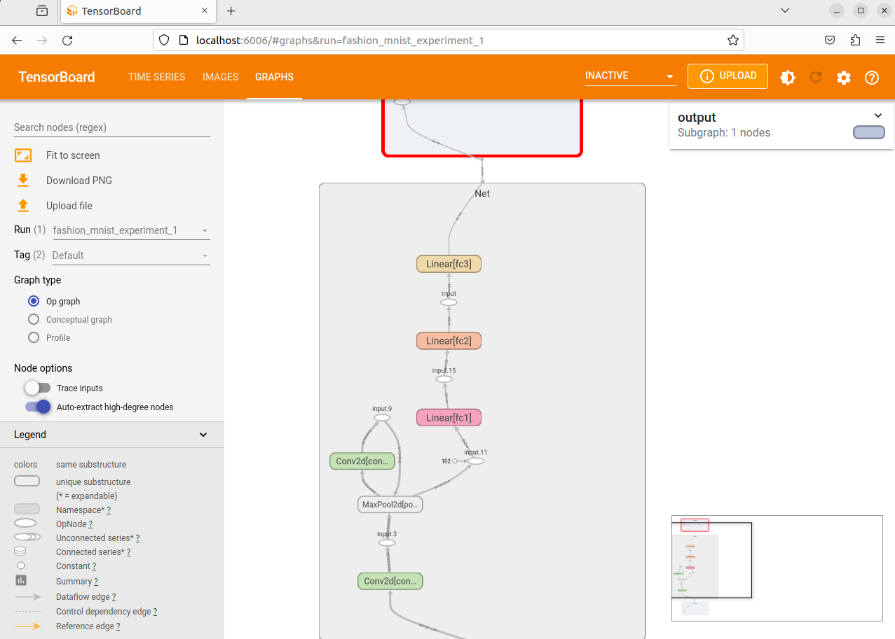

# CNN（卷积神经网络）

## 简介

- Convolutional Neural Networks

- 局部连接、权值共享

- 擅长处理图像特别是图像识别等相关机器学习问题


> 左图是全连接网络，右图是卷积神经网络

## 网络结构


卷积神经网络的基本结构大致包括：**卷积层、激活函数、池化层、全连接层、输出层**等。

### 卷积层（Convolutional layer）


- 卷积运算的目的是提取输入的不同特征
- 在网络训练过程中，使用自定义大小的卷积核作为一个滑动窗口对输入数据进行卷积
- 卷积过程实质上就是两个矩阵做乘法，在卷积过程后，原始输入矩阵会有一定程度的缩小
- 卷积层中还有两个重要的参数，分别是**偏置**和**激活**，**偏置向量**的作用是对卷积后的数据进行简单线性的加法
- 2*2的方块叫做卷积核，里面的参数是根据反向传播算法自动优化的，也就是我们要训练的参数

### 激活函数


还是ReLU比较常用

由于经过Relu函数激活后的数据0值一下都变成0，而这部分数据难免有一些**我们需要的数据被强制取消**，所以为了尽可能的降低损失，我们就在激活层的前面，**卷积层的后面加上一个偏置向量**，对数据进行一次简单的线性加法，使得数据的值产生一个横向的偏移，**避免被激活函数过滤掉更多的信息**。

### 池化层（Pooling layer）

- 通常在卷积层之后会得到维度很大的特征，将特征切成几个区域，取其最大值或平均值，得到新的、维度较小的特征
- 池化方式一般有两种，一种为取最大值，另一种为取均值


两种方式比较：


- 如果输入是图像的话，那么池化层的最主要作用就是压缩图像

- 池化层的具体作用：
  1. **特征不变性**，也就是我们在图像处理中经常提到的特征的尺度不变性，池化操作就是图像的resize，平时一张狗的图像被缩小了一倍我们还能认出这是一张狗的照片，这说明这张图像中仍保留着狗最重要的特征，我们一看就能判断图像中画的是一只狗，图像压缩时去掉的信息只是一些无关紧要的信息，而留下的信息则是具有尺度不变性的特征，是最能表达图像的特征。
  2. **特征降维**，我们知道一幅图像含有的信息是很大的，特征也很多，但是有些信息对于我们做图像任务时没有太多用途或者有重复，我们可以把这类**冗余信息去除，把最重要的特征抽取出来**，这也是池化操作的一大作用。
  3. 在一定程度上**防止过拟合**，更方便优化。

### **全连接层**（ Fully-Connected layer）

把所有局部特征结合变成全局特征，用来计算最后每一类的得分。全连接层往往在**分类问题**中用作网络的最后层，作用主要为将数据矩阵进行全连接，然后按照分类数量输出数据。

## 卷积动画

https://www.bilibili.com/video/BV1AA411778b/?spm_id_from=333.337.search-card.all.click

## 训练过程


## 基本特征

### 局部感知

处理图像时，网络只关注输入的一小部分区域，而不是整个图像。

### 参数共享

在整个输入图像上使用相同的权重（卷积核）来提取特征。这意味着卷积核的参数在整个图像上是共享的，而不是每个位置都有独立的参数。

# Pytorch实战

## 池化、卷积一张图片

刚才的概念可能比较清楚，也可能还是很抽象，因此我瞎写了一段简单的代码来看看卷积神经网络到底在干嘛。

```python
import torch
import torch.nn as nn
import torchvision.transforms as transforms
import matplotlib.pyplot as plt
from PIL import Image


# 定义简单的卷积神经网络
class SimpleCNN(nn.Module):
    def __init__(self):
        super(SimpleCNN, self).__init__()
        self.conv1 = nn.Conv2d(3, 16, kernel_size=3, stride=1, padding=1)
        """
        nn.Conv2d: 这是PyTorch中用于定义二维卷积层的类。
        3: 输入通道数。在这里，假设输入是RGB彩色图像，所以有3个通道（对应于红、绿、蓝三个颜色通道）。
        16: 输出通道数。这决定了卷积层中卷积核的数量，也就是生成的特征图的数量。
        kernel_size=3: 卷积核的大小，即卷积窗口的尺寸。在这里，卷积核的大小是3x3。
        stride=1: 卷积核的步幅，即卷积窗口在每一步移动的像素数。这里的步幅是1。
        padding=1: 零填充的大小。这是在输入的每一侧添加零值像素的数量，以确保卷积操作不会改变特征图的空间维度。在这里，填充大小是1。
        因此，self.conv1 是一个将3个输入通道的图像通过16个卷积核进行卷积操作的卷积层。
        """
        self.pool = nn.MaxPool2d(kernel_size=2, stride=2)
        """
        nn.MaxPool2d: 这是PyTorch中用于定义二维最大池化层的类。
        kernel_size=2: 池化窗口的大小，即池化操作中用于计算最大值的窗口大小。这里是2x2。
        stride=2: 池化窗口的步幅，即池化窗口在每一步移动的像素数。这里的步幅是2。
        """
        self.conv2 = nn.Conv2d(16, 32, kernel_size=3, stride=1, padding=1)
        self.fc1 = nn.Linear(46 * 84 * 32, 256)

    def forward(self, x):
        x0 = self.pool(x) # 不参与前向传播过程，只是感受一下池化的效果
        
        x = self.pool(torch.relu(self.conv1(x)))
        x1 = x
        x = self.pool(torch.relu(self.conv2(x)))
        x2 = x
        x = x.view(x.size(0), -1)
        x = torch.relu(self.fc1(x))
        return x, x0, x1, x2


# 加载自定义PNG格式图片
def load_custom_image(image_path):
    image = Image.open(image_path)
    # 查看图像张量的形状
    transform = transforms.Compose([
        transforms.Resize((184, 338)),  # 输入图像的尺寸调整为 (184,338) 像素
        transforms.ToTensor(),
    ])
    print(image)
    image = transform(image).unsqueeze(0)
    """
    .unsqueeze(0): 这一部分使用了PyTorch的unsqueeze方法，将数据张量的维度增加。
    在这里，0表示在第0维度（即在最前面）增加一个维度。这样做的目的是将单张图像添加一个批次维度，
    因为在深度学习中，通常期望输入是一个批次的数据，即 (batch_size, channels, height, width)。
    """
    print(image)
    # 查看图像张量的形状
    print("图像张量的形状:", image.size())
    return image


# 设置路径
image_path = "img/picture/eg.png"

# 加载模型和权重
model = SimpleCNN()
# model.load_state_dict(torch.load("path/to/your/model.pth"))  # 替换成你的模型权重路径

# 设置模型为评估模式
model.eval()

# 读取图片并进行预测
image = load_custom_image(image_path)
output, x0, x1, x2 = model(image)


# 可视化池化层的输出
def visualize_output(pool_output, layer_name):
    pool_output = pool_output.squeeze().detach().numpy()
    num_channels = pool_output.shape[0]
    fig, axes = plt.subplots(1, num_channels, figsize=(12, 3))

    for i in range(num_channels):
        axes[i].imshow(pool_output[i], cmap='gray')
        axes[i].axis('off')
        axes[i].set_title(f'{i + 1}')

    fig.suptitle(f'{layer_name} Output')
    plt.show()


image = image.squeeze().permute(1, 2, 0).numpy()
plt.imshow(image)
plt.show()

# 可视化第一个池化层的输出
visualize_output(x1, '1')
visualize_output(x2, '2')

# 显示图片和预测结果
image = x0.squeeze().permute(1, 2, 0).numpy()
plt.imshow(image)
plt.show()
```

只池化是这样的，看起来像素低了一点。


原图也进行了可视化，对比一下不难发现：坐标轴的范围发生了变化


经过第一个卷积层，共输出16个通道的特征，我们对比其中两个：


很明显，前者已经看不见人的形状，只能看到外面的一些点，后者的特征基本都保留了。所以每个卷积核可以提取不同的特征，关注不同的细节。

> 注意，这里的参数都是随机初始化的，我们并没有训练模型对卷积核的参数进行调整，训练后每个卷积核可能趋向更明显地关注某个特征。

## Mnist手写数字识别

这个是很多教程都会用的一个数据集，不仅仅是cnn，我们也来看看。

```python
from __future__ import print_function
import argparse
import torch
import torch.nn as nn
import torch.nn.functional as F
import torch.optim as optim
from torchvision import datasets, transforms
from torch.optim.lr_scheduler import StepLR
import matplotlib.pyplot as plt
import numpy as np


class Net(nn.Module):
    def __init__(self):
        super(Net, self).__init__()
        self.conv1 = nn.Conv2d(1, 32, 3, 1)
        self.conv2 = nn.Conv2d(32, 64, 3, 1)
        self.dropout1 = nn.Dropout(0.25)
        self.dropout2 = nn.Dropout(0.5)
        # Dropout 层以指定的概率（这里是 0.5）随机将输入数据的某些元素置为零
        # 用于减少过拟合现象
        self.fc1 = nn.Linear(64 * 12 * 12, 128)  # 为什么是64*12*12
        self.fc2 = nn.Linear(128, 10)

    def forward(self, x):
        x = self.conv1(x)  # 32*26*26
        x = F.relu(x)
        x = self.conv2(x)  # 64*24*24
        x = F.relu(x)
        x = F.max_pool2d(x, 2)  # 64*12*12
        x = self.dropout1(x)
        x = torch.flatten(x, 1)  # 64*12*12
        x = self.fc1(x)
        x = F.relu(x)
        x = self.dropout2(x)
        x = self.fc2(x)
        output = F.log_softmax(x, dim=1)
        return output


def train(args, model, device, train_loader, optimizer, epoch):
    """
    训练函数
    Args:
        args: 命令行参数
        model: 模型
        device: 计算设备 (cpu 或 cuda)
        train_loader: 训练数据加载器
        optimizer: 优化器
        epoch: 当前的训练轮数
    Returns:
        无
    """
    model.train()  # 设置模型为训练模式
    for batch_idx, (data, target) in enumerate(train_loader):
        data, target = data.to(device), target.to(device)
        optimizer.zero_grad()  # 梯度清零
        output = model(data)  # 前向传播
        loss = F.nll_loss(output, target)  # 计算损失
        loss.backward()  # 反向传播，计算梯度
        optimizer.step()  # 更新模型参数
        if batch_idx % args.log_interval == 0:
            # 打印训练进度和损失
            print('Train Epoch: {} [{}/{} ({:.0f}%)]\tLoss: {:.6f}'.format(
                epoch, batch_idx * len(data), len(train_loader.dataset),
                       100. * batch_idx / len(train_loader), loss.item()))
            if args.dry_run:
                break


def test(model, device, test_loader):
    """
    测试函数
    Args:
        model: 模型
        device: 计算设备 (cpu 或 cuda)
        test_loader: 测试数据加载器
    Returns:
        无
    """
    model.eval()  # 设置模型为评估模式
    test_loss = 0
    correct = 0
    with torch.no_grad():
        for data, target in test_loader:
            data, target = data.to(device), target.to(device)
            output = model(data)  # 前向传播
            test_loss += F.nll_loss(output, target, reduction='sum').item()  # 累加损失值
            pred = output.argmax(dim=1, keepdim=True)  # 获取每个样本的预测结果
            correct += pred.eq(target.view_as(pred)).sum().item()  # 统计预测正确的数量
    test_loss /= len(test_loader.dataset)  # 计算平均损失值
    # 打印测试结果，包括平均损失和准确率
    print('\nTest set: Average loss: {:.4f}, Accuracy: {}/{} ({:.0f}%)\n'.format(
        test_loss, correct, len(test_loader.dataset),
        100. * correct / len(test_loader.dataset)))


def main():
    """
    主函数
    Args:
        无
    Returns:
        无
    """
    # 可以认为是设置了一系列配置
    # 可以动态调参，比如： python train.py --batch-size 32 --epochs 10
    parser = argparse.ArgumentParser(description='PyTorch MNIST Example')
    parser.add_argument('--batch-size', type=int, default=64, metavar='N',
                        help='input batch size for training (default: 64)')
    parser.add_argument('--test-batch-size', type=int, default=1000, metavar='N',
                        help='input batch size for testing (default: 1000)')
    parser.add_argument('--epochs', type=int, default=14, metavar='N',
                        help='number of epochs to train (default: 14)')
    parser.add_argument('--lr', type=float, default=1.0, metavar='LR',
                        help='learning rate (default: 1.0)')
    parser.add_argument('--gamma', type=float, default=0.7, metavar='M',
                        help='Learning rate step gamma (default: 0.7)')
    parser.add_argument('--no-cuda', action='store_true', default=False,
                        help='disables CUDA training')
    parser.add_argument('--no-mps', action='store_true', default=False,
                        help='disables macOS GPU training')
    parser.add_argument('--dry-run', action='store_true', default=False,
                        help='quickly check a single pass')
    parser.add_argument('--seed', type=int, default=1, metavar='S',
                        help='random seed (default: 1)')
    parser.add_argument('--log-interval', type=int, default=10, metavar='N',
                        help='how many batches to wait before logging training status')
    parser.add_argument('--save-model', action='store_true', default=False,
                        help='For Saving the current Model')
    args = parser.parse_args()

    use_cuda = not args.no_cuda and torch.cuda.is_available()
    use_mps = not args.no_mps and torch.backends.mps.is_available()

    torch.manual_seed(args.seed)

    # 根据是否可用 CUDA 和 MPS 设置计算设备
    if use_cuda:
        device = torch.device("cuda")
    elif use_mps:
        device = torch.device("mps")
    else:
        device = torch.device("cpu")

    # 设置训练和测试数据加载器的参数
    train_kwargs = {'batch_size': args.batch_size}
    test_kwargs = {'batch_size': args.test_batch_size}

    # 如果可用 CUDA，设置相关参数
    if use_cuda:
        cuda_kwargs = {'num_workers': 1,
                       'pin_memory': True,
                       'shuffle': True}
        train_kwargs.update(cuda_kwargs)
        test_kwargs.update(cuda_kwargs)

    # 设置数据的转换操作
    transform = transforms.Compose([
        transforms.ToTensor(),
        """
		将数据转换为张量（Tensor）格式。这个操作将图像数据从 PIL 图像对象或 NumPy 数组转换为张量，并且将像素值缩放到 0 到 1 之间的范围。
        """
        transforms.Normalize((0.1307,), (0.3081,))
        """
        将每个通道的像素值减去均值（0.1307）并除以标准差（0.3081）。(概率论转换成标准正态分布)
        """
    ])

    # 创建训练集和测试集的数据集对象
    dataset1 = datasets.MNIST('../data', train=True, download=True,
                              transform=transform)
    dataset2 = datasets.MNIST('../data', train=False,
                              transform=transform)

    # 创建训练集和测试集的数据加载器
    train_loader = torch.utils.data.DataLoader(dataset1, **train_kwargs)
    test_loader = torch.utils.data.DataLoader(dataset2, **test_kwargs)

    # 随机查看25张图片
    visualize(train_loader)

    # 创建模型对象并将其移动到指定的计算设备上
    model = Net().to(device)

    # 创建优化器对象
    # Adadelta优化器根据参数的梯度和历史梯度信息来更新参数，从而最小化训练过程中的损失函数。
    optimizer = optim.Adadelta(model.parameters(), lr=args.lr)

    # 创建学习率调度器对象
    # StepLR是一个学习率调度器类，用于动态调整学习率。它根据预定义的步长和系数来更新学习率。
    # 学习率调度器可以根据训练的进展情况自动调整学习率
    scheduler = StepLR(optimizer, step_size=1, gamma=args.gamma)

    # 开始训练和测试循环
    for epoch in range(1, args.epochs + 1):
        train(args, model, device, train_loader, optimizer, epoch)  # 训练模型
        test(model, device, test_loader)  # 在测试集上评估模型
        scheduler.step()  # 调整学习率

    # 如果指定了保存模型的选项，则保存模型参数
    if args.save_model:
        torch.save(model.state_dict(), "mnist_cnn.pt")

    torch.save(model, 'minis.pth')


def visualize(train_loader):
    data_iter = iter(train_loader)
    images, labels = next(data_iter)
    print(images.size())

    random_indices = np.random.choice(len(images), size=25, replace=False)
    random_images = images[random_indices]
    random_labels = labels[random_indices]

    fig, axes = plt.subplots(5, 5, figsize=(10, 10))

    for i, ax in enumerate(axes.ravel()):
        image = random_images[i].squeeze().numpy()
        label = random_labels[i].item()
        ax.imshow(image, cmap='gray')
        ax.set_title(f'Label: {label}')
        ax.axis('off')

    plt.tight_layout()
    plt.show()


if __name__ == '__main__':
    main()
```

二维卷积核conv2d的参数含义如下：


> 这里没有设置`padding`

**x.view**和**torch.flatten**

```python
x = x.view(x.size(0), -1) # x.size(0)表示它第一个维度的长度，也就是批次数量

x = torch.flatten(x, 1)

x = torch.flatten(x, -1)

# 以上3个效果一样，第一个数字用于指定第一个维度的长度，后面的-1表示自动把剩下的维度相乘，即展平张量，设置1表示第二个维度是1
```

## 输出计算公式

在分类问题中，我们经常要把所有通道展平成一维向量，然后输入进全连接网络训练参数，那么展平后的第一个层要有多少个神经元呢？也就是输入的特征数量是多少？


> 我卷积了n次，好难算呀，怎么办？


运行一下程序：


所以说前者应该输入123648

> 也可以打印形状、或者Pytorch内置实现了这种方法（但我暂时还没看见过）

# 步长


# 过拟合和欠拟合

1. **过拟合（Overfitting）**：
   - **定义**：过拟合发生在模型过于复杂，以至于在训练数据上表现得很好，但在新的、未见过的数据上表现较差。模型在训练集上“记住”了数据的细节，而不是学到了通用的规律。
   - **比喻**：就像一个学生过于死记硬背了一本书的内容，但在考试时遇到类似但不同的问题时无法正确推理。
   - **特征**：训练误差较低，验证（或测试）误差较高。
   - **解决方法**：简化模型，减少特征数量，引入正则化，增加更多的训练数据等。
2. **欠拟合（Underfitting）**：
   - **定义**：欠拟合发生在模型过于简单，无法很好地拟合训练数据，导致在训练集和新数据上都表现不佳。模型没有捕捉到数据中的重要模式和信息。
   - **比喻**：就像一个学生没有认真学习，对问题的理解过于肤浅，无法正确回答大多数问题。
   - **特征**：训练误差和验证（或测试）误差都较高。
   - **解决方法**：增加模型的复杂度，添加更多的特征，提供更多的数据，调整超参数等。

# VISUALIZING（可视化）

> 跟上面的关系不大，只是我觉得下节课的内容还是放到下节课比较好

先请出老朋友：

```python
# imports
import matplotlib.pyplot as plt
import numpy as np

import torch
import torchvision
import torchvision.transforms as transforms

import torch.nn as nn
import torch.nn.functional as F
import torch.optim as optim

# transforms
transform = transforms.Compose(
    [transforms.ToTensor(),
     transforms.Normalize((0.5,), (0.5,))])

# datasets
trainset = torchvision.datasets.FashionMNIST('./data',
                                             download=True,
                                             train=True,
                                             transform=transform)
testset = torchvision.datasets.FashionMNIST('./data',
                                            download=True,
                                            train=False,
                                            transform=transform)

# dataloaders
trainloader = torch.utils.data.DataLoader(trainset, batch_size=4,
                                          shuffle=True, num_workers=2)

testloader = torch.utils.data.DataLoader(testset, batch_size=4,
                                         shuffle=False, num_workers=2)

# constant for classes
classes = ('T-shirt/top', 'Trouser', 'Pullover', 'Dress', 'Coat',
           'Sandal', 'Shirt', 'Sneaker', 'Bag', 'Ankle Boot')


# helper function to show an image
# (used in the `plot_classes_preds` function below)
def matplotlib_imshow(img, one_channel=False):
    if one_channel:
        img = img.mean(dim=0)
    img = img / 2 + 0.5  # unnormalize
    npimg = img.numpy()
    if one_channel:
        plt.imshow(npimg, cmap="Greys")
    else:
        plt.imshow(np.transpose(npimg, (1, 2, 0)))


class Net(nn.Module):
    def __init__(self):
        super(Net, self).__init__()
        self.conv1 = nn.Conv2d(1, 6, 5)
        self.pool = nn.MaxPool2d(2, 2)
        self.conv2 = nn.Conv2d(6, 16, 5)
        self.fc1 = nn.Linear(16 * 4 * 4, 120)
        self.fc2 = nn.Linear(120, 84)
        self.fc3 = nn.Linear(84, 10)

    def forward(self, x):
        x = self.pool(F.relu(self.conv1(x)))
        x = self.pool(F.relu(self.conv2(x)))
        x = x.view(-1, 16 * 4 * 4)
        x = F.relu(self.fc1(x))
        x = F.relu(self.fc2(x))
        x = self.fc3(x)
        return x


net = Net()

criterion = nn.CrossEntropyLoss()
optimizer = optim.SGD(net.parameters(), lr=0.001, momentum=0.9)
```

> 虽然没了注释，但是应该感觉也没那么难以理解

## TensorBoard setup（安装tensorboard）

```python
from torch.utils.tensorboard import SummaryWriter

# 默认的`log_dir`是"runs"，在这里我们更具体地指定
writer = SummaryWriter('runs/fashion_mnist_experiment_1')
```

创建图像并保存

```python
# 获取一些随机的训练图像。将trainloader转换为一个可迭代对象，
# 并使用next()函数从中获取下一批图像和标签
dataiter = iter(trainloader)
images, labels = next(dataiter)

# 创建一个图像网格。使用torchvision.utils.make_grid()函数将多个图像拼接在一起形成一个大的图像
img_grid = torchvision.utils.make_grid(images)

# 显示图像。使用matplotlib_imshow函数将图像网格显示出来。one_channel=True表示图像是单通道的灰度图像
matplotlib_imshow(img_grid, one_channel=True)
plt.show()

# 将图像网格写入TensorBoard。
# 使用writer.add_image()函数将图像网格写入TensorBoard的日志文件中，以便后续可视化和分析。
# 图像将保存在名为'four_fashion_mnist_images'的图像组中
writer.add_image('four_fashion_mnist_images', img_grid)
```

查看：

> 可能会提示你有什么没安装，或者运行的时候版本不对，我试出来这样是可以的
>
> ```python
> pip install tensorflow==2.12.1 
> ```
>
> ```python
> pip install numpy==1.22.1 # 更换一下numpy版本
> ```

```bash
tensorboard --logdir=runs # (找到对应路径)终端输入，然后访问localhost:6006
```


## Inspect（使用TensorBoard检查模型）

- 能够可视化复杂的模型结构

```python
writer.add_graph(net, images)  # 使用add_graph方法将模型net以及输入数据images添加到TensorBoard的日志文件中，以可视化模型的结构。
writer.close()  # 关闭TensorBoard的写入器，确保所有数据都已写入日志文件。
```



## Adding a “Projector” to TensorBoard

"Projector"是TensorBoard中的一个功能，用于**可视化高维数据的降维表示**。通过将数据投射到较低维度的空间，我们可以更好地理解和分析数据之间的关系。

```python
# 辅助函数
def select_n_random(data, labels, n=100):
    '''
    从数据集中随机选择n个数据点及其对应的标签
    
    参数：
        data：数据集
        labels：标签集
        n：选择的数据点数量，默认为100
        
    返回值：
        选择的数据点和对应的标签
    '''
    assert len(data) == len(labels)

    perm = torch.randperm(len(data))
    return data[perm][:n], labels[perm][:n]


# 随机选择图像及其目标索引
images, labels = select_n_random(trainset.data, trainset.targets)


# 获取每个图像的类别标签
class_labels = [classes[lab] for lab in labels]


# 记录嵌入（Embedding）
features = images.view(-1, 28 * 28)
writer.add_embedding(features,
                    metadata=class_labels,
                    label_img=images.unsqueeze(1), global_step=0)
writer.close()
```

现在在TensorBoard的"Projector"选项卡中，你可以看到这100个图像的投影，每个图像是784维的，被投影到三维空间中。


> 这是动图，他会自己转

## Tracking model training with TensorBoard（跟踪模型训练）

在之前的示例中，我们只是简单地打印模型每2000次迭代的运行损失。现在，我们将改为将运行损失记录到TensorBoard中，并通过`plot_classes_preds`函数提供对模型预测的可视化。

```python
def images_to_probs(net, images):
    """
    从训练好的网络和图像列表中生成预测和相应的概率

    参数:
        net: 训练好的神经网络模型
        images: 图像列表，作为网络的输入

    返回值:
        preds: 预测的类别，作为NumPy数组
        probs: 预测的概率列表，与预测类别对应

    """
    # 对图像进行前向传播，得到输出
    output = net(images)
    # 将输出的概率转换为预测的类别
    _, preds_tensor = torch.max(output, 1)
    # 将预测结果转换为NumPy数组，并去除维度为1的维度
    preds = np.squeeze(preds_tensor.numpy())
    # 使用softmax函数将输出的概率转换为预测的概率，并存储在列表中
    return preds, [F.softmax(el, dim=0)[i].item() for i, el in zip(preds, output)]
```

```python
def plot_classes_preds(net, images, labels):
    """
    使用训练好的网络、图像批次和标签生成Matplotlib图形，显示网络的最高预测及其概率，
    并将实际标签与此信息进行比较，根据预测是否正确进行着色。
    使用了"images_to_probs"函数。
    """
    # 使用images_to_probs函数获取预测的类别和概率
    preds, probs = images_to_probs(net, images)
    # 在批次中绘制图像，并显示预测和真实标签
    fig = plt.figure(figsize=(12, 48))
    for idx in np.arange(4):
        # 添加子图
        ax = fig.add_subplot(1, 4, idx+1, xticks=[], yticks=[])
        # 在子图中显示图像
        matplotlib_imshow(images[idx], one_channel=True)
        # 设置子图标题，包括预测的类别、概率和真实标签，并根据预测是否正确设置标题的颜色
        ax.set_title("{0}, {1:.1f}%\n(label: {2})".format(
            classes[preds[idx]],  # 预测的类别
            probs[idx] * 100.0,  # 预测的概率
            classes[labels[idx]]),  # 真实标签
                    color=("green" if preds[idx]==labels[idx].item() else "red"))  # 根据预测是否正确着色
    # 返回生成的图形对象
    return fig
```

训练

```python
running_loss = 0.0
for epoch in range(1):  # 多次循环遍历数据集

    for i, data in enumerate(trainloader, 0):

        # 获取输入数据；data是一个包含输入和标签的列表
        inputs, labels = data

        # 梯度置零
        optimizer.zero_grad()

        # 前向传播 + 反向传播 + 优化
        outputs = net(inputs)
        loss = criterion(outputs, labels)
        loss.backward()
        optimizer.step()

        running_loss += loss.item()
        if i % 1000 == 999:    # 每1000个小批次...

            # ...记录当前运行的损失值
            writer.add_scalar('训练损失',
                            running_loss / 1000,
                            epoch * len(trainloader) + i)

            # ...记录一个用Matplotlib绘制的图，显示模型在随机小批次上的预测结果与实际结果
            writer.add_figure('预测 vs. 实际',
                            plot_classes_preds(net, inputs, labels),
                            global_step=epoch * len(trainloader) + i)
            running_loss = 0.0
print('训练完成')
```

查看：


每一千轮随机抽取4件，查看预测准确率


## Assessing trained models with TensorBoard（评估模型）

```python
# 1. 获取测试集中每个样本对应的概率预测，以一个大小为 test_size x num_classes 的张量表示
# 2. 获取测试集中每个样本的预测结果，以一个大小为 test_size 的张量表示
# 运行时间约为10秒
class_probs = []  # 存储概率预测结果的列表
class_label = []  # 存储标签的列表
with torch.no_grad():
    for data in testloader:
        images, labels = data
        output = net(images)
        class_probs_batch = [F.softmax(el, dim=0) for el in output]  # 对输出进行softmax处理得到概率预测结果

        class_probs.append(class_probs_batch)
        class_label.append(labels)

test_probs = torch.cat([torch.stack(batch) for batch in class_probs])  # 将概率预测结果拼接成一个张量
test_label = torch.cat(class_label)  # 将标签拼接成一个张量

# 辅助函数
def add_pr_curve_tensorboard(class_index, test_probs, test_label, global_step=0):
    '''
    根据给定的 "class_index"（从0到9）绘制相应的精确率-召回率曲线
    '''
    tensorboard_truth = test_label == class_index  # 获取该类别的真实标签
    tensorboard_probs = test_probs[:, class_index]  # 获取该类别的概率预测结果

    writer.add_pr_curve(classes[class_index],
                        tensorboard_truth,
                        tensorboard_probs,
                        global_step=global_step)  # 将精确率-召回率曲线添加到TensorBoard中
    writer.close()

# 绘制所有类别的精确率-召回率曲线
for i in range(len(classes)):
    add_pr_curve_tensorboard(i, test_probs, test_label)
```

可以查看10个类别下的预测准确率曲线：


## 总结一下

可以让你看懂自己在干嘛

# 作业


