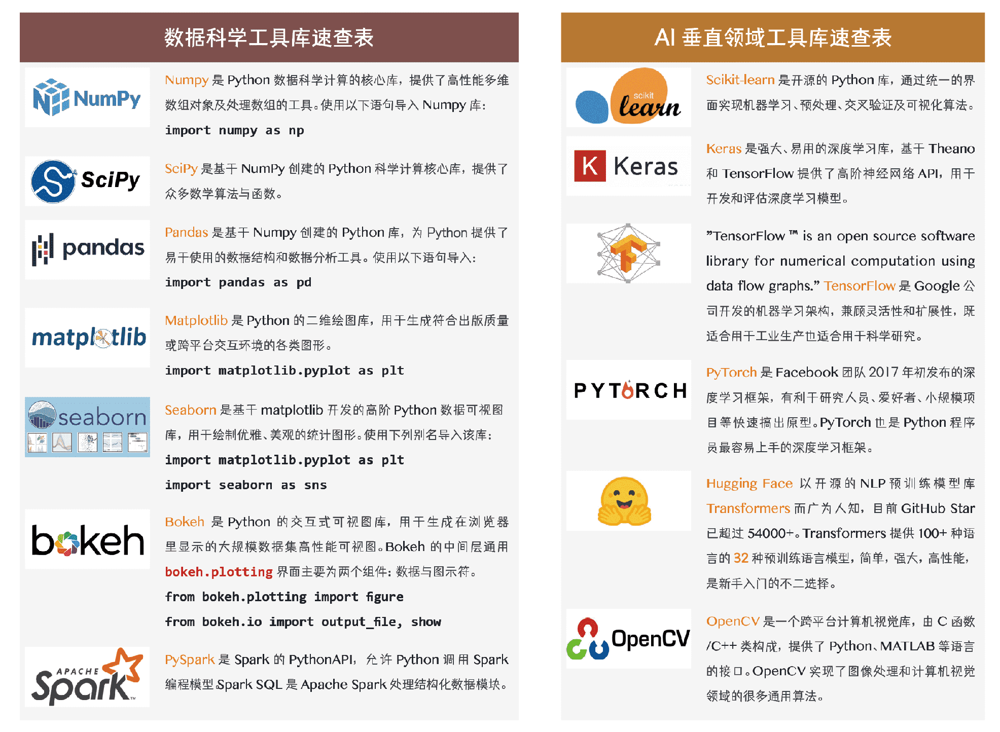
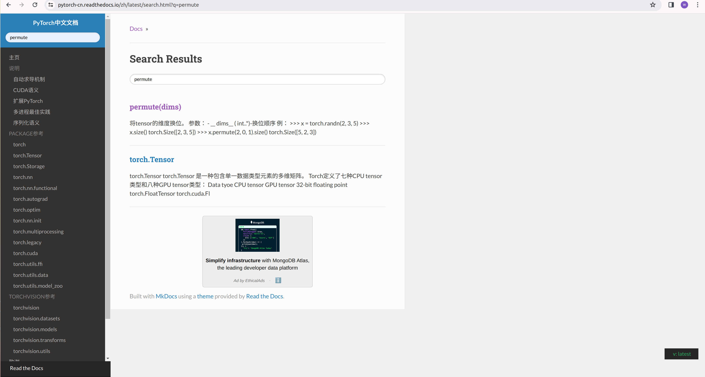
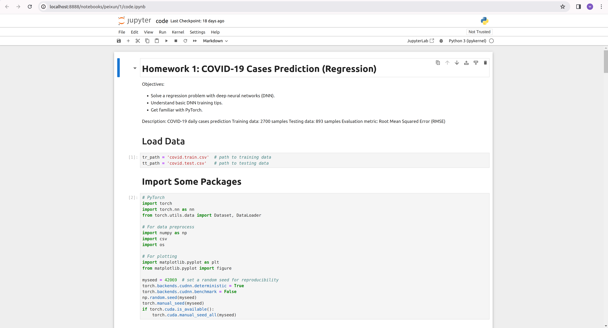
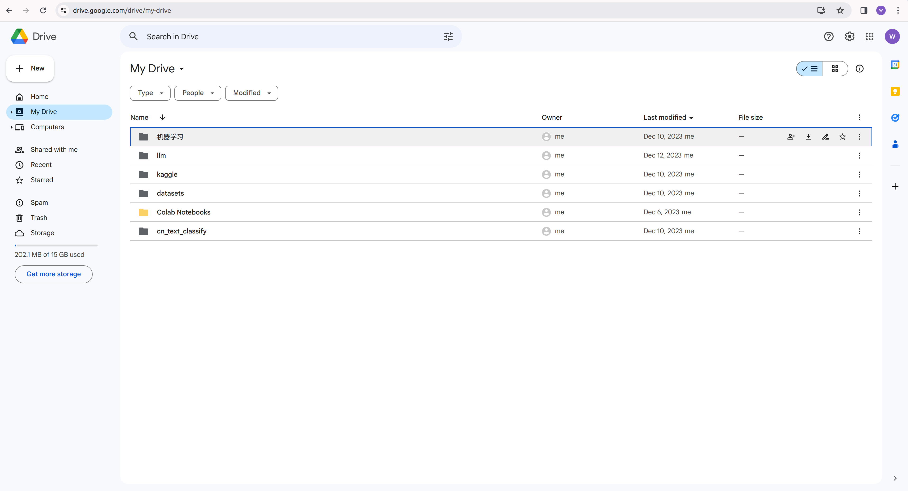
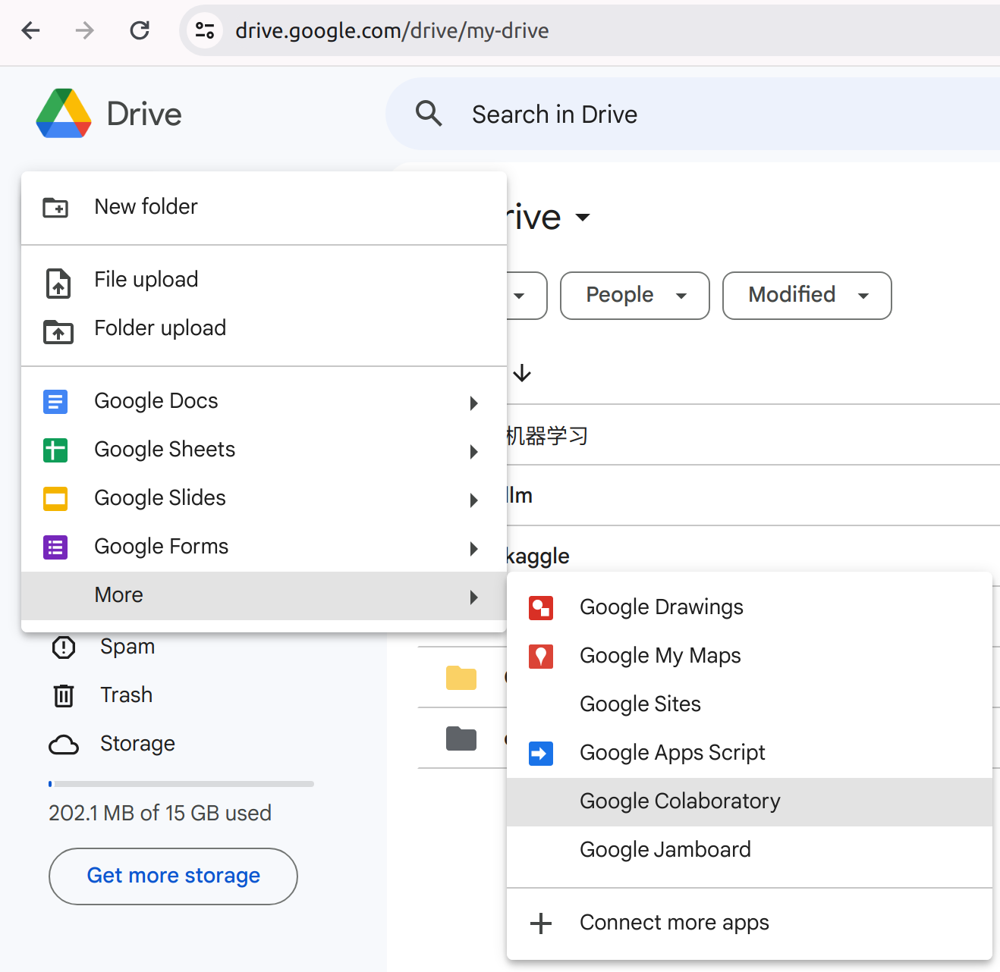
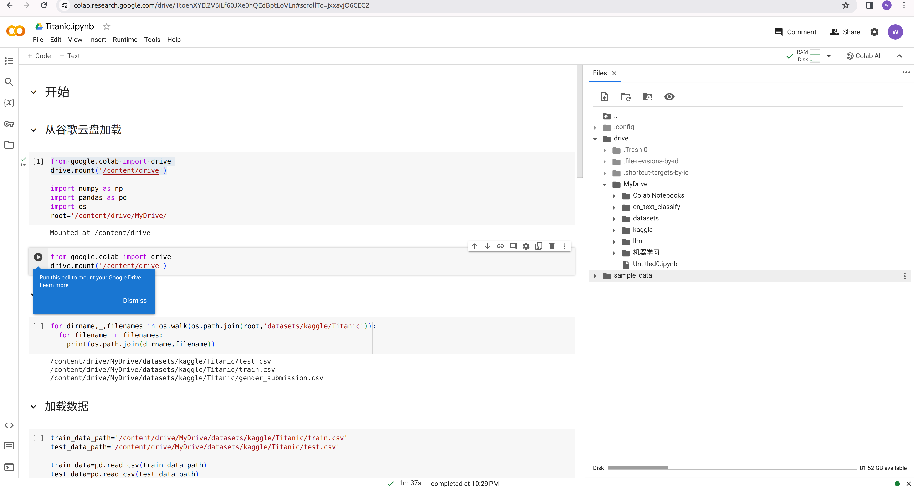
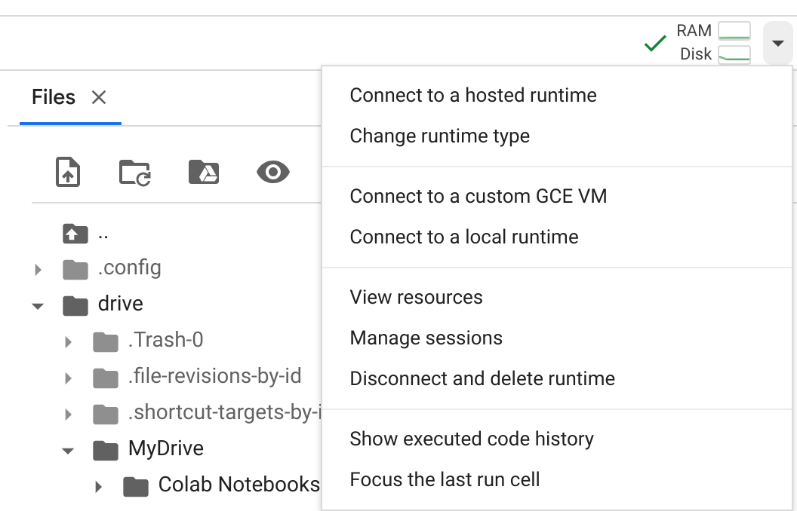

为了让大家能够更好地利用剩余时间和寒假进行自学，我先做个简要的概述。

# 常用包

每一列前四个都比较常用



> 如何学习这些包

搜索这些名字，都能找到英文文档（大部分也有中文文档）

进入之后会有`Guide`或者`Tutorials`（或者其他表示相似含义的）

> 当我遇到一个函数不知道什么意思时

可以问`chatgpt`，也可以在文档的`Documents/Docs`或者`API`界面进行搜索，比如：

# 学习工具

## Google Chrome

用谷歌搜索引擎往往能更容易找到你需要的答案。

## Github

搜代码，搜教程，搜资料。

## Chatgpt

一些简单的问题解答得比较好，复杂的问题它也不一定理得清，可能会误导你。

注册不了帐号的请用这个： [poe.com]()


## Jupyter Notebook

就跟markdown差不多，只不过你可以点击运行代码，获得输出，更方便。

使用需要先安装：

```bash
pip install jupyter
```

然后在一个目录下，终端输入：

```bash
jupyter notebook
```

会自动弹出界面（文件目录），找到你想要打开的`ipynb`文件双击打开



界面类似这样，上面的箭头点了就可以运行。

## Google Drive

首先要有个谷歌帐号

https://www.google.com/drive/

> sign in：登录  sign up：注册 
>
> 学会自己看英文 



界面差不多是这样，就是一个云盘系统，帮你储存文件。

它也可以用来写`notebook`，点击`New`，点`Google Colabtory`



## Colab

继续刚才，我们可以像`notebook`一样正常写`markdown`文本或代码，这里需要解决两个问题。

1. 怎么使用自己的数据集

   ```python
   # 从谷歌云盘加载
   from google.colab import drive
   drive.mount('/content/drive')
   ```

   因为这里似乎只能全部加载，加载之后我们的数据会在`/content/drive/MyDrive/`下：

   

   然后就可以正常使用了

2. 如何安装所需包

   大部分机器学习和深度学习需要的包这个环境里都自动给我们安装好了，如果运行了以后提示没有，那就需要手动安装一下（你每次打开这个文件都要手动安装）

   ```bash
   ！pip install <pkg_name>
   ```

   很简单，直接在你要执行的命令前面加个感叹号，输入在代码中就可以执行了。

   同理，如果你想在终端执行某些命令，都可以把!加载命令的前面。

环境默认CPU，也可以选择TPU（Colab自创的，速度快一点，但是有限制），点击`Connect`，然后选择`Change runtime type`



# Kaggle

数据科学竞赛平台

- 可以获得用机器学习模型解决实际问题的经验

- 可以白嫖数据集

- 可以学习别人的解决思路

> 如果你实力够强的话，有可能获得牌子或奖金，也对找工作比较有帮助。

但是**全是**英文

`Kaggle`有自带的`notebook`，用起来比`colab`难受一点，但是如果做比赛的话可以快速获取数据集以及提交。

# 基础数学

- 高等数学（损失函数公式推导）

- 线性代数（矩阵无处不在）

- 概率论（机器学习理论）

想要研究深入的话会遇到很多数学公式

# 英语

> 老师你发的资料全是英文，我看不懂
>
> 老师，这个界面我该点哪啊

# 兴趣是最好的老师

> 我感觉做这个物体的识别检测还挺有意思的，我感觉那个语音识别挺好玩的

# 学了有什么用

1. 加入蓝山工作室？
2. 跟数模有相关性，有些题目可以用神经网络来解决
3. 大数据比赛
4. 软件类比赛，给软件加个机器学习很高级
5. 读研大概率要学，而且往往没有人教

最后，希望大家不断提升学习能力，这比学会某个知识更有用。